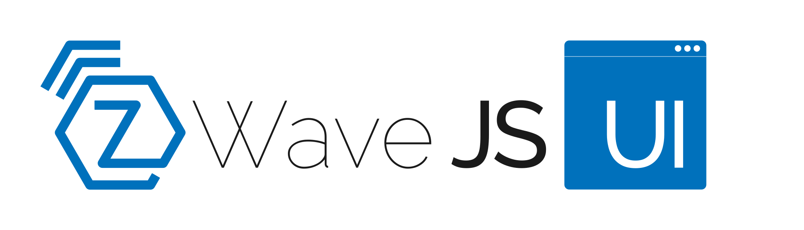

# Z-Wave JS UI

  

   

 

Full featured Z-Wave **Control Panel** and MQTT **Gateway**.

- **Backend**: [NodeJS](https://nodejs.org/en/), [Express](https://expressjs.com/), [socket.io](https://github.com/socketio/socket.io), [MQTTjs](https://github.com/mqttjs/MQTT.js), [zwavejs](https://github.com/zwave-js/node-zwave-js), [Webpack](https://webpack.js.org/)
- **Frontend**: [Vue](https://vuejs.org/), [socket.io](https://github.com/socketio/socket.io), [Vuetify](https://github.com/vuetifyjs/vuetify)

## Main features

- **Control Panel UI**: Directly control your nodes and their values from the UI, including:
  - *Nodes management*: Add, remove, and configure all nodes in your Z-Wave network
  - *Firmware updates*: Update device firmware using manufacturer-supplied firmware files
  - *Groups associations*: Add, edit, and remove direct node associations
  - *Z-Wave JS Exposed*: Provides full-access to Z-Wave JS's APIs
- **Full-Featured Z-Wave to MQTT Gateway**: Expose Z-Wave devices to an MQTT broker in a fully configurable manner
- **Secured**: Supports *HTTPS* and *user authentication*
- **Scene Management**: Create scenes and trigger them by using MQTT apis (with timeout support)
- **Debug Logs in the UI**: See debug logs directly from the UI
- **Access Store Files in the UI**: Access the files are stored in the persistent `store` folder directly from the UI
- **Network Graph**: Provides a beautiful map showing how nodes are communicating with the controller
- **Automatic/Scheduled backups**: Scheduled backup of NVM and store directory. It's also possible to enable automatic backups of NVM before every node inclusion/exclusion/replace, this ensures to create a safe restore point before any operation that can cause a network corruption.
- **Zniffer Support**: Supports Zniffer mode for debugging Z-Wave traffic
- **Dianogsitics**: Use Healtcheck and Link quality tools to diagnose network issues

## Software integrations

- [Home Assistant](https://www.home-assistant.io/): using the official [addon](https://github.com/hassio-addons/addon-zwave-js-ui) or standalone installation through plain MQTT or MQTT Discovery. See [docs](https://zwave-js.github.io/zwave-js-ui/#/homeassistant/homeassistant-mqtt)
- [Domoticz](https://www.domoticz.com/): using MQTT Discovery. See [docs](https://www.domoticz.com/wiki/Zwave-JS-UI)
- [OpenHAB](https://www.openhab.org/): using MQTT Discovery. See [docs](https://community.openhab.org/t/zwave-js-ui-in-place-of-oh-zwave-binding/150007/102)
- [Jeedom](https://www.jeedom.com/en/): using official Z-Wave JS [plugin](https://doc.jeedom.com/en_US/plugins/automation%20protocol/zwavejs/beta/)
- [HomeSeer](https://homeseer.com/): Using [Z-Wave Plus Plugin](https://docs.homeseer.com/products/setting-up-the-z-wave-plus-plugin)

## Documentation

[Project documentation](https://zwave-js.github.io/zwave-js-ui/#/)
