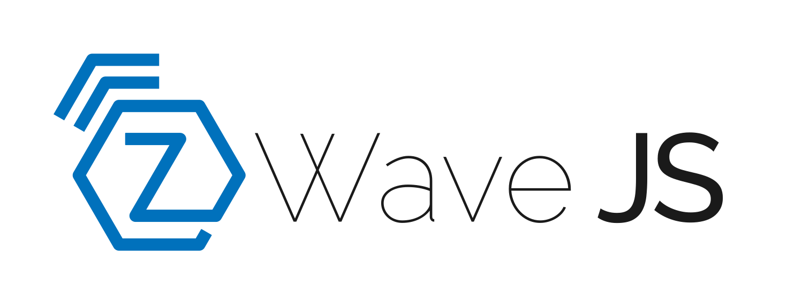
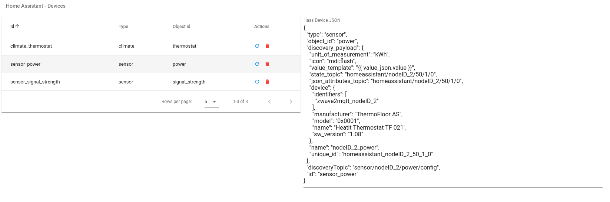
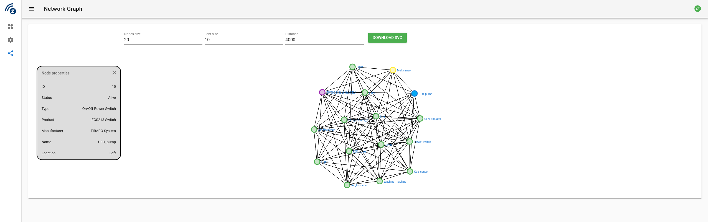

# Zwave To MQTT


[](http://makeapullrequest.com)
[](https://madewithvuejs.com/p/zwavejs2mqtt/shield-link)
[](https://opensource.org/licenses/mit-license.php)
[](https://github.com/zwave-js/zwavejs2mqtt/actions?query=workflow%3Aci+branch%3Amaster)
[](https://github.com/zwave-js/zwavejs2mqtt/actions?query=workflow%3A%22Docker+Build%22+branch%3Amaster)
[](https://github.com/zwave-js/zwavejs2mqtt/releases)
[](https://coveralls.io/github/zwave-js/zwavejs2mqtt?branch=master)
[](https://snyk.io/test/github/zwave-js/zwavejs2mqtt?targetFile=package.json)
[](https://david-dm.org/zwave-js/zwavejs2mqtt)
[](https://david-dm.org/zwave-js/zwavejs2mqtt?type=dev)
[](https://lgtm.com/projects/g/zwave-js/zwavejs2mqtt/alerts/)
[](https://lgtm.com/projects/g/zwave-js/zwavejs2mqtt/context:javascript)

[](https://join.slack.com/t/zwavejs2mqtt/shared_invite/enQtNjc4NjgyNjc3NDI2LTc3OGQzYmJlZDIzZTJhMzUzZWQ3M2Q3NThmMjY5MGY1MTc4NjFiOWZhZWE5YjNmNGE0OWRjZjJiMjliZGQyYmU 'Join channel')

[](https://www.buymeacoffee.com/MVg9wc2HE 'Buy Me A Coffee')

[](https://hub.docker.com/r/zwavejs/zwavejs2mqtt)


**TO**


Fully configurable Zwave to MQTT **Gateway** and **Control Panel**.

- **Backend**: [NodeJS](https://nodejs.org/en/), [Express](https://expressjs.com/), [socket.io](https://github.com/socketio/socket.io), [Mqttjs](https://github.com/mqttjs/MQTT.js), [zwavejs](https://github.com/zwave-js/node-zwave-js), [Webpack](https://webpack.js.org/)
- **Frontend**: [Vue](https://vuejs.org/), [socket.io](https://github.com/socketio/socket.io), [Vuetify](https://github.com/vuetifyjs/vuetify)

## 📖 Table of contents

- [Zwave To MQTT](#zwave-to-mqtt)
  - [📖 Table of contents](#-table-of-contents)
  - [:electric_plug: Installation](#-installation)
    - [DOCKER :tada: way](#docker--way)
    - [Kubernetes way](#kubernetes-way)
    - [NodeJS or PKG version](#nodejs-or-pkg-version)
    - [Reverse Proxy Setup](#reverse-proxy-setup)
  - [:nerd_face: Development](#-development)
    - [Developing against a different backend](#developing-against-a-different-backend)
  - [:wrench: Usage](#-usage)
    - [Zwave](#zwave)
    - [MQTT](#mqtt)
    - [Gateway](#gateway)
      - [Special topics](#special-topics)
      - [Gateway values table](#gateway-values-table)
  - [:file_folder: Nodes Management](#-nodes-management)
    - [Add a node](#add-a-node)
    - [Remove a node](#remove-a-node)
    - [Replace failed node (NOT IMPLEMENTED YET)](#replace-failed-node-not-implemented-yet)
    - [Remove a failed node](#remove-a-failed-node)
  - [:star: Features](#️-features)
  - [:robot: Home Assistant integration (BETA)](#-home-assistant-integration-beta)
    - [Components management](#components-management)
      - [Rediscover Node](#rediscover-node)
      - [Edit existing component](#edit-existing-component)
      - [Add new component](#add-new-component)
    - [Custom Components](#custom-components)
      - [Identify the Device id](#identify-the-device-id)
      - [Thermostats](#thermostats)
      - [Fans](#fans)
      - [Thermostats with Fans](#thermostats-with-fans)
  - [:gift: MQTT APIs](#-mqtt-apis)
    - [Zwave Events](#zwave-events)
      - [Example](#example)
    - [Zwave APIs](#zwave-apis)
      - [Custom APIs](#custom-apis)
    - [Set values](#set-values)
    - [Broadcast](#broadcast)
  - [:camera: Screenshots](#-screenshots)
    - [Settings](#settings)
    - [Control Panel](#control-panel)
    - [Groups associations](#groups-associations)
    - [Scenes](#scenes)
    - [Mesh](#mesh)
    - [Debug](#debug)
  - [Health check endpoints](#health-check-endpoints)
  - [Environment variables](#environment-variables)
  - [:question: FAQ](#-faq)
  - [:pray: Thanks](#-thanks)
  - [:pencil: TODOs](#-todos)
  - [:bowtie: Author](#bowtie-author)

## :electric_plug: Installation

### DOCKER :tada: way

```bash
# Using volumes as persistence
docker run --rm -it -p 8091:8091 --device=/dev/ttyACM0 --mount source=zwavejs2mqtt,target=/usr/src/app/store zwavejs/zwavejs2mqtt:latest

# Using local folder as persistence
mkdir store
docker run --rm -it -p 8091:8091 --device=/dev/ttyACM0 -v $(pwd)/store:/usr/src/app/store zwavejs/zwavejs2mqtt:latest

# As a service
wget https://raw.githubusercontent.com/zwave-js/zwavejs2mqtt/master/docker/docker-compose.yml
docker-compose up
```

> Replace `/dev/ttyACM0` with your serial device

For more info about docker check [here](docker/README.md)

### Kubernetes way

```bash
kubectl apply -k https://raw.githubusercontent.com/zwave-js/zwavejs2mqtt/master/kustomization.yaml
```

> You will almost certainly need to instead use this as a base, and then layer on top patches or resource customizations to your needs or just copy all the resources from the [kubernetes resources](./kubernetes) directory of this repo

### NodeJS or PKG version

1. Now you can use the packaged version (you don't need NodeJS/npm installed) or clone this repo and build the project:

   - For the packaged version:

     ```sh
     cd ~
     mkdir zwavejs2mqtt
     cd zwavejs2mqtt
     # download latest version
     curl -s https://api.github.com/repos/zwave-js/zwavejs2mqtt/releases/latest  \
     | grep "browser_download_url.*zip" \
     | cut -d : -f 2,3 \
     | tr -d \" \
     | wget -i -
     unzip zwavejs2mqtt-v*.zip
     ./zwavejs2mqtt
     ```

   - If you want to compile last code from github:

     ```sh
     git clone https://github.com/zwave-js/zwavejs2mqtt
     cd zwavejs2mqtt
     npm install
     npm run build
     npm start
     ```

2. Open the browser <http://localhost:8091>

### Reverse Proxy Setup

If you need to setup ZWave To MQTT behind a reverse proxy that needs a _subpath_ to
work, take a look at [the reverse proxy configuraiton docs](docs/subpath.md).

## :nerd_face: Development

Developers who wants to debug the application have to open 2 terminals.

In first terminal run `npm run dev` to start webpack-dev for front-end developing and hot reloading at <http://localhost:8092>
(**THE PORT FOR DEVELOPING IS 8092**)

In the second terminal run `npm run dev:server` to start the backend server with inspect and auto restart features (if you don't have nodemon installed: `npm install -g nodemon`)

To package the application run `npm run pkg` command and follow the steps

### Developing against a different backend

By default running `npm run dev:server` will proxy the reequests to a backend listening on _localhost_ on port _8091_.

If you want to run the development frontend against a different backend you have the following environment variables
that you can use to redirect to a different backend:

- **SERVER_HOST**: [Default: 'localhost'] the hostname or IP of the backend server you want to use;
- **SERVER_PORT**: [Default: '8091'] the port of the backend server you want to use;
- **SERVER_SSL**: [Default: undefined] if set to a value it will use _https_/_wss_ to connect to the backend;
- **SERVER_URL**: [Default: use the other variables] the full URL for the backend API, IE: `https://zwavetomqtt.home.net:8443/`
- **SERVER_WS_URL**: [Default: use the other variables] the full URL for the backend Socket, IE: `wss://zwavetomqtt.home.net:8443/`

## :wrench: Usage

Firstly you need to open the browser at the link <http://localhost:8091> and edit the settings for Zwave, MQTT and the Gateway.

### Zwave

Zwave settings:

- **Serial port**: The serial port where your controller is connected
- **Network key** (Optional): Zwave network key if security is enabled. The correct format is like the OZW key but without `0x` `,` and spaces: OZW: `0x5C, 0x14, 0x89, 0x74, 0x67, 0xC4, 0x25, 0x98, 0x51, 0x8A, 0xF1, 0x55, 0xDE, 0x6C, 0xCE, 0xA8` Zwavejs: `5C14897467C42598518AF155DE6CCEA8`
- **Log level**: Set the zwave-js Library log level
- **Log to file**: Enable this to store zwave-js logs to a file
- **Commands timeout**: Seconds to wait before automatically stop inclusion/exclusion
- **Hidden settings**: advanced settings not visible to the user interface, you can edit these by setting in the settings.json
  - `zwave.plugin` defines a js script that will be included with the `this` context of the zwave client, for example you could set this to `hack` and include a `hack.js` in the root of the app with `module.exports = zw => {zw.client.on("scan complete", () => console.log("scan complete")}`
  - `zwave.options` overrides options passed to the zwave js Driver constructor [ZWaveOptions](https://zwave-js.github.io/node-zwave-js/#/api/driver?id=zwaveoptions)

### MQTT

Mqtt settings:

- **Name**: A unique name that identify the Gateway.
- **Host**: The url of the broker. Insert here the protocol if present, example: `tls://localhost`. Mqtt supports these protocols: `mqtt`, `mqtts`, `tcp`, `tls`, `ws` and `wss`
- **Port**: Broker port
- **Reconnect period**: Milliseconds between two reconnection tries
- **Prefix**: The prefix where all values are published
- **QoS**: Quality Of Service (check MQTT specs) of outgoing packets
- **Retain**: The retain flag of outgoing packets
- **Clean**: Sets the clean flag when connecting to the broker
- **Store**: Enable/Disable persistent storage of packets (QoS > 0). If disabled in memory storage will be used but all packets stored in memory are lost in case of shutdowns or unexpected errors.
- **Allow self signed certs**: When using encrypted protocols, set this to true to allow self signed certificates (**WARNING** this could expose you to man in the middle attacks)
- **Ca Cert and Key**: Certificate Authority, Client Key and Client Certificate files required for secured connections (if broker requires valid certificates, this fields can be leave empty otherwise)
- **Auth**: Enable this if broker requires auth. If so you need to enter also a valid **username** and **password**.

### Gateway

Gateway settings:

- **Gateway type**: This setting specify the logic used to publish Zwave Nodes Values in MQTT topics. At the moment there are 3 possible configuration, two are automatic (all values are published in a specific topic) and one needs to manually configure which values you want to publish to MQTT and what topic to use. For every gateway type you can set custom topic values, if gateway is not in 'configure manually' mode you can omit the topic of the values (the topic will depends on the gateway type) and use the table to set values you want to `poll` or if you want to scale them using `post operation`

  1. **ValueId Topics**: _Automatically configured_. The topic where zwave values are published will be:

     `<mqtt_prefix>/<?node_location>/<nodeId>/<commandClass>/<endpoint>/<property>/<propertyKey>`

     - `mqtt_prefix`: the prefix set in Mqtt Settings
     - `node_location`: location of the Zwave Node (optional, if not present will not be added to the topic)
     - `nodeId`: the unique numerical id of the node in Zwave network
     - `commandClass`: the command class number of the value
     - `endpoint`: the endpoint number (if the node has more then one endpoint)
     - `property`: the value [property](https://zwave-js.github.io/node-zwave-js/#/api/valueid)
     - `propertyKey`: the value [propertyKey](https://zwave-js.github.io/node-zwave-js/#/api/valueid)

  2. **Named Topics**: _Automatically configured_. The topic where zwave values are published will be:

     `<mqtt_prefix>/<?node_location>/<node_name>/<class_name>/<?endpoint>/<propertyName>/<propertyKey>`

     - `mqtt_prefix`: the prefix set in Mqtt Settings
     - `node_location`: location of the Zwave Node (optional, if not present will not be added to the topic)
     - `node_name`: name of the node, if not set will be `nodeID_<node_id>`
     - `class_name`: the valueId command class name corresponding to given command class number or `unknownClass_<class_id>` if the class name is not known
     - `?endpoint`: Used just with multi-instance devices. The main enpoint (0) will not have this part in the topic but other instances will have: `endpoint_<endpoint>`
     - `propertyName`: the value [propertyName](https://zwave-js.github.io/node-zwave-js/#/api/valueid)
     - `propertyKey`: the value [propertyKey](https://zwave-js.github.io/node-zwave-js/#/api/valueid)

  3. **Configured Manually**: _Needs configuration_. The topic where zwave values are published will be:

     `<mqtt_prefix>/<?node_location>/<node_name>/<value_topic>`

     - `mqtt_prefix`: the prefix set in Mqtt Settings
     - `node_location`: location of the Zwave Node (optional, if not present will not be added to the topic)
     - `node_name`: name of the node, if not set will be `nodeID_<node_id>`
     - `value_topic`: the topic you want to use for that value (taken from gateway values table).

- **Payload type**: The content of the payload when an update is published:

  - **JSON Time-Value**: The payload will be a JSON object like:

    ```json
    {
      "time": 1548683523859,
      "value": 10
    }
    ```

  - **Entire ValueId Object**
    The payload will contain all info of a value from Zwave network:

    ```js
    {
      id: "38-0-targetValue",
      nodeId: 8,
      commandClass: 38,
      commandClassName: "Multilevel Switch",
      endpoint: 0,
      property: "targetValue",
      propertyName: "targetValue",
      propertyKey: undefined,
      type: "number",
      readable: true,
      writeable: true,
      description: undefined,
      label: "Target value",
      default: undefined,
      genre: "user",
      min: 0,
      max: 99,
      step: undefined,
      unit: undefined,
      list: false,
      value: undefined,
      lastUpdate: 1604044669393,
    }
    ```

    Example of a valueId with `states`:

    ```js
    {
      id: "112-0-200",
      nodeId: 8,
      commandClass: 112,
      commandClassName: "Configuration",
      endpoint: 0,
      property: 200,
      propertyName: "Partner ID",
      propertyKey: undefined,
      type: "number",
      readable: true,
      writeable: true,
      description: undefined,
      label: "Partner ID",
      default: 0,
      genre: "config",
      min: 0,
      max: 1,
      step: undefined,
      unit: undefined,
      list: true,
      states: [
        {
          text: "Aeon Labs Standard Product",
          value: 0,
        },
        {
          text: "others",
          value: 1,
        },
      ],
      value: 0,
      lastUpdate: 1604044675644,
    }
    ```

  - **Just value**: The payload will contain only the row Numeric/String/Bool value

- **Ignore status updates**: Enable this to prevent gateway to send an MQTT message when a node changes its status (dead/sleep == false, alive == true)
- **Ignore location**: Enable this to remove nodes location from topics
- **Send Zwave Events**: Enable this to send all Zwave client events to MQTT. More info [here](#zwave-events)
- **Use nodes name instead of numeric nodeIDs**: When gateway type is `ValueId` use this flag to force to use node names instead of node ids in topic.
- :star:**Hass discovery**:star:: Enable this to automatically create entities on Hass using MQTT autodiscovery (more about this [here](#robot-home-assistant-integration-beta))
- **Discovery Prefix**: The prefix to use to send MQTT discovery messages to HASS

Once finished press `SAVE` and gateway will start Zwave Network Scan, than go to 'Control Panel' section and wait until the scan is completed to check discovered devices and manage them.

Settings, scenes and Zwave configuration are stored in `JSON` files under project `store` folder that you can easily **import/export** for backup purposes.

#### Special topics

- **Node status**:

`<mqtt_prefix>/<?node_location>/<node_name>/status`

The payload will be `true` if node is ready `false` otherwise. If the payload is in JSON format it will also contain the node status string in `status` property (`Alive`, `Awake`, `Dead`)

- **Node notifications**:

`<mqtt_prefix>/<?node_location>/<node_name>/notification/<notificationLabel>`

The payload will be the notification `prameters` (can be null or not based on the notification type)

#### Gateway values table

The Gateway values table can be used with all gateway types to customize specific values topic for each device type found in the network and do some operations with them. Each value has this properties:

- **Device**: The device type. Once scan is complete, the gateway creates an array with all devices types found in the network. A device has a `device_id` that is unique, it is composed by this node properties: `<manufacturerid>-<productid>-<producttype>`.
- **Value**: The value you want to customize
- **Device Class**: If the value is a multilevel sensor, a binary sensor or a meter you can set a custom `device_class` to use with home assistant discovery. Check [sensor](https://www.home-assistant.io/components/sensor/#device-class) and [binary sensor](https://www.home-assistant.io/components/binary_sensor/#device-class)
- **Topic**: The topic to use for this value. It is the topic added after topic prefix, node name and location. If gateway type is different than `Manual` this can be leave blank and the value topic will be the one based on the gateway configuration chosen
- **Post operation**: If you want to convert your value (eg. '/10' '/100' '*10' '*100')
- **Parse Send**: Enable this to allow users to specify a custom `function(value)` to parse the value sent to MQTT. The function must be sync
- **Parse receive**: Enable this to allow users to specify a custom `function(value)` to parse the value received via MQTT. The function must be sync

## :file_folder: Nodes Management

### Add a node

To add a node using the UI, go to Control Panel and from the actions dropdown menu select `Start inclusion`, click send (:airplane:) button to enable the inclusion mode in your controller, a popup will ask you if you want to start it in `Secure mode`. In the `Controller status` text field you should see `Non-secure/Secure inclusion started` when inclusion has been successfully enabled on the controller. Wait few seconds and once the interview finish your node will be visible in the table.

### Remove a node

To remove a node using the UI, go to Control Panel and from the actions dropdown menu select `Start exclusion`, click send (:airplane:) button to enable the exclusion mode in your controller and enable the exclusion mode in your device to. `Controller status` should show `Exclusion started` when exclusion has been successfully enabled on the controller. Wait few seconds and your node will be removed from the table.

### Replace failed node (NOT IMPLEMENTED YET)

To replace a failed node from the UI you have to use the command `Replace Failed Node`, if everything is ok the controller will start inclusion mode and status will be `Waiting`, now enable inclusion on your device to add it to the network by replacing the failed one.

### Remove a failed node

If a node is missing or marked as dead. There is a way to cleanup the controller by executing `Remove Failed Node`. This will forcebly delete the node from the controller.
It can only succeed if:

- Node has ben first marked as failed using `Has node failed`
- Marked as Dead by the controller

Alive and Sleeping nodes cannot be deleted.

## :star: Features

- Configurable Zwave to Mqtt Gateway
- Home Assistant integration (**beta**)
- Zwave Control Panel:
  - **Nodes management**: check all nodes discovered in the z-wave network, send/receive nodes values updates directly from the UI and send action to the nodes and controller for diagnostics and network heal
  - **Custom Node naming and Location**: Starting from v1.3.0 nodes `name` and `location` are stored in a JSON file named `nodes.json`. This because not all nodes have native support for naming and location features ([#45](https://github.com/zwave-js/zwavejs2mqtt/issues/45)). This change is back compatible with older versions of this package: on startup it will get all nodes names and location from the `zwcfg_homeHEX.xml` file (if present) and create the new `nodes.json` file based on that. This file can be imported/exported from the UI control panel with the import/export buttons placed on the top of nodes table, on the right of controller actions select.
  - **Firmware updates**: You are able to send firmware updates to your devices using the UI, just select the controller action `Begin Firmware Update`
  - **Groups associations**: create associations between nodes (also supports multi-instance associations, need to use last version of zwave-js)
  - **Custom scenes management**
- Log debug in UI
- Mesh graph showing devices neighbors

## :robot: Home Assistant integration (BETA)

**At least Home Assistant >= 0.84 is required!**

The easiest way to integrate zwavejs2mqtt with Home Assistant is by
using [MQTT discovery](https://www.home-assistant.io/docs/mqtt/discovery/).
This allows zwavejs2mqtt to automatically add devices to Home Assistant.
To enable this feature remember to set the flag **Hass Discovery** in Gateway settings configuration.

**ATTENTION**: Hass updates often break zwavejs2mqtt device discovery. For this reason zwavejs2mqtt will try to be always compatible with latest hass version. Check the changelog before update!

To achieve the best possible integration (including MQTT discovery):

- In your **zwavejs2mqtt** gateway settings enable `Homeassistant discovery` flag and enable the MQTT **retain** too. The retain flag for MQTT is suggested to be sure that, once discovered, each device get the last value published (otherwise you have to wait for a value change)

**NB:** Starting from version `4.0.0` the default Birth/Will topic is `homeassistant/status` in order to reflect defaults birth/will of Hass `0.113` th

- In your **Home Assistant** `configuration.yaml`:

```yaml
mqtt:
  discovery: true
  discovery_prefix: <your_discovery_prefix>
  broker: [YOUR MQTT BROKER] # Remove if you want to use builtin-in MQTT broker
  birth_message:
    topic: 'hass/status' # or homeassistant/status if z2m version >= 4.0.0
    payload: 'online'
  will_message:
    topic: 'hass/status' # or homeassistant/status if z2m version >= 4.0.0
    payload: 'offline'
```

Mind you that if you want to use the embedded broker of Home Assistant you
have to [follow this guide](https://www.home-assistant.io/docs/mqtt/broker#embedded-broker).

zwavejs2mqtt is expecting Home Assistant to send it's birth/will
messages to `hass/status` (or `homeassistant/status` if z2m version >= 4.0.0). Be sure to add this to your `configuration.yaml` if you want
zwavejs2mqtt to resend the cached values when Home Assistant restarts.

zwavejs2mqtt try to do its best to guess how to map devices from Zwave to HASS. At the moment it try to guess the device to generate based on zwave values command classes, index and units of the value. When the discovered device doesn't fit your needs you can you can set custom a `device_class` to values using Gateway value table.

### Components management

To see the components that have been discovered by zwavejs2mqtt go to Control Panel UI, select a Node from the Nodes table then select the Node tab from tabs menu at the bottom of Nodes table. Now at the Bottom of the page, after Node values section you can find a new section called `Home Assistant - Devices`. Here you will see a table with all devices created for the selected node.



**ATTENTION**
Once edited the devices will loose all their customizations after a restart. To prevent this you can store the node hassDevices by pressing `STORE` button at the top of hass devices table. By pressing it the hassDevices will be stored in `nodes.json` file that can be imported/exported easily from control panel UI at the top of nodes table.

#### Rediscover Node

If you update node name/location you have to also rediscover values of this node as they may have wrong topics. To do this press on `REDISCOVER NODE` green button on top of **Home Assistant - Devices** table (check previous picture)

#### Edit existing component

If you select a device it's configuration will be displayed as a JSON object on the right. With the selected device you can edit it and send some actions:

- `Update`: Update in-memory hass device configuration
- `Rediscover`: Re-discover this device using the `discoveryTopic` and `discovery_payload` of the configuration
- `Delete`: Delete the device from Hass entities of selected node

#### Add new component

If no device is selected you can manually insert a device JSON configuration. If the configuration is valid you can press the button `Add` to add it to devices. If the process complete successfully the device will be added to the Hass Devices table and you can now select it from the table and press on `Rediscover` to discover your custom device

### Custom Components

At the moment auto discovery just creates components like `sensor`, `cover` `binary_sensor` and `switch`. For more complex components like `climate` and `fan` you need to provide a configuration. Components configurations are stored in `hass/devices.js` file. Here are contained all components that Zwave2MQTT needs to create for each Zwave device type. The key is the Zwave device unique id (`<manufacturerid>-<productid>-<producttype>`) the value is an array with all HASS components to create for that Zwave Device.

**UPDATE**: Starting from version 2.0.7 you can specify your custom devices configuration inside `store/customDevices(.js|.json)` file. This allows users that use Docker to create their custom hass devices configuration without the need to build a new container. If using `.json` format zwavejs2mqtt will watch for file changes and automatically load new components on runtime without need to restart the application.

> ONCE YOU SUCCESSFULLY INTEGRATE NEW COMPONENTS PLEASE SEND A PR!

#### Identify the Device id

Starting from version 2.2.0 device id is shown on node tab of control panel before the inputs for update the node name and locations.

Before version 2.2.0 you can get the device id in this ways:

First (and easier) option is to add a random value in gateway values table for the desired device, the device id will be visible in first column of the table (`Devices`) between square brackets `[<deviceID>] Device Name`

Second option would be to retrieve it from [here](https://github.com/zwave-js/open-zwave/blob/master/config/manufacturer_specific.xml). Each device has Manufacturerid, product id and a product type in **HEX format** and needs to be converted in decimal:

```xml
<Manufacturer id="019b" name="ThermoFloor AS">
    <Product config="thermofloor/heatit021.xml" id="0001" name="Heatit Thermostat TF 021" type="0001"/>
    <Product config="thermofloor/heatit056.xml" id="0202" name="Heatit Thermostat TF 056" type="0003"/>
    <Product config="thermofloor/heatit-zdim.xml" id="2200" name="Heatit ZDim" type="0003"/>
</Manufacturer>
```

In this example, if we have choose `Heatit Thermostat TF 056`:

- Manufacturer Id: `19b` --> `411`
- Product Id: `202` --> `514`
- Product type: `3` --> `3`

So in decimal format will become: `411-514-3`. This is the device id of `Heatit Thermostat TF 056`

#### Thermostats

```js
{ // Heatit Thermostat TF 021 (ThermoFloor AS)
    "type": "climate",
    "object_id": "thermostat",
    "values": ["64-1-0", "49-1-1", "67-1-1", "67-1-2"],
    "mode_map": {"off": "Off", "heat": "Heat (Default)", "cool": "Cool"},
    "setpoint_topic": { "Heat (Default)": "67-1-1", "Cool": "67-1-2" },
    "default_setpoint": "67-1-1",
    "discovery_payload": {
        "min_temp": 15,
        "max_temp": 30,
        "modes": ["off", "heat", "cool"],
        "mode_state_topic": "64-1-0",
        "mode_command_topic": true,
        "current_temperature_topic": "49-1-1",
        "current_temperature_template": "{{ value_json.value }}",
        "temperature_state_template": "{{ value_json.value }}",
        "temperature_command_topic": true
    }
}
```

- **type**: The hass [MQTT component](https://www.home-assistant.io/components/mqtt/) type
- **object_id**: The unique id of this object (must be unique for the device)
- **values**: Array of values used by this component
- **mode_map**: Key-Value object where keys are [MQTT Climate](https://www.home-assistant.io/components/climate.mqtt/) modes and values are the matching thermostat modes values
- **setpoint_topic**: Key-Value object where keys are the modes of the Zwave thermostat and values are the matching setpoint `value_id` (use this if your thermostat has more than one setpoint)
- **default_setpoint**: The default thermostat setpoint.
- **discovery_payload**: The payload sent to hass to discover this device. Check [here](https://www.home-assistant.io/integrations/climate.mqtt/) for a list with all supported options
  - **min_temp/max_temp**: Min/Max temperature of the thermostat
  - **modes**: Array of Hass Climate supported modes. Allowed values are `[“auto”, “off”, “cool”, “heat”, “dry”, “fan_only”]`
  - **mode_state_topic**: `value_id` of mode value
  - **current_temperature_topic**: `value_id` of current temperature value
  - **current_temperature_template/temperature_state_template**: Template used to fetch the value from the MQTT payload
  - **temperature_command_topic/mode_command_topic**: If true this values are subscribed to this topics to send commands from Hass to change this values

Thermostats are most complex components to create, in this device example the setpoint topic changes based on the mode selected. zwavejs2mqtt handles the mode changes by updating the device discovery payload to match the correct setpoint based on the mode selected.

#### Fans

```js
{ // GE 1724 Dimmer
    "type": "fan",
    "object_id": "dimmer",
    "values": ["38-1-0"],
    "discovery_payload": {
        "command_topic": "38-1-0",
        "speed_command_topic": "38-1-0",
        "speed_state_topic": "38-1-0",
        "state_topic": "38-1-0",
        "speeds": ["off", "low", "medium", "high"],
        "payload_low_speed": 24,
        "payload_medium_speed": 50,
        "payload_high_speed": 99,
        "payload_off": 0,
        "payload_on": 99,
        "state_value_template": " 0  99 ",
        "speed_value_template": " 24  50  99  0 "
    }
}
```

- **type**: The hass [MQTT component](https://www.home-assistant.io/components/mqtt/) type
- **object_id**: The unique id of this object (must be unique for the device)
- **values**: Array of values used by this component
- **discovery_payload**: The payload sent to hass to discover this device. Check [here](https://www.home-assistant.io/integrations/fan.mqtt/) for a list with all supported options
  - **command_topic**: The topic to send commands
  - **state_topic**: The topic to receive state updates
  - **speed_command_topic**: The topic used to send speed commands
  - **state_value_template**: The template used to set the value ON/OFF based on the payload received
  - **speed_value_template**: The template to use to set the speed `["off", "low", "medium", "high"]` based on the payload received

#### Thermostats with Fans

The main template is like the thermostat template. The things to add are:

```js
{ // GoControl GC-TBZ48 (Linear Nortek Security Control LLC)
    "type": "climate",
    "object_id": "thermostat",
    "values": [
        "49-1-1",
        "64-1-0",
        "66-1-0", // <-- add fan values
        "67-1-1",
        "67-1-2",
        "68-1-0" // <-- add fan values
    ],
    "fan_mode_map": { // <-- add fan modes map
        "on": "On",
        "auto": "Auto"
    },
    "mode_map": {
        "off": "Off",
        "heat": "Heat",
        "cool": "Cool",
        "auto": "Auto"
    },
    "setpoint_topic": {
        "Heat": "67-1-1",
        "Cool": "67-1-2"
    },
    "default_setpoint": "67-1-1",
    "discovery_payload": {
        "min_temp": 60,
        "max_temp": 85,
        "modes": [
            "off",
            "heat",
            "cool",
            "auto"
        ],
        "fan_modes": [ // <-- add fan supported modes
            "on",
            "auto"
        ],
        "action_topic": "66-1-0",
        "mode_state_topic": "64-1-0",
        "mode_command_topic": true,
        "current_temperature_topic": "49-1-1",
        "current_temperature_template": "{{ value_json.value }}",
        "temperature_state_template": "{{ value_json.value }}",
        "temperature_low_command_topic": true,
        "temperature_low_state_template": "{{ value_json.value }}",
        "temperature_high_command_topic": true,
        "temperature_high_state_template": "{{ value_json.value }}",
        "fan_mode_command_topic": true,
        "fan_mode_state_topic": "68-1-0" // <-- add fan state topic
    }
}
```

## :gift: MQTT APIs

You have full access to all [zwavejs APIs](https://zwave-js.github.io/node-zwave-js/#/README) (and more) by simply using MQTT.

### Zwave Events

If **Send Zwave Events** flag of Gateway settings section is enabled all Zwave-js events are published to MQTT. There are both [Driver](https://zwave-js.github.io/node-zwave-js/#/api/driver?id=driver-events) and [Node](https://zwave-js.github.io/node-zwave-js/#/api/node?id=zwavenode-events) and [Controller](https://zwave-js.github.io/node-zwave-js/#/api/node?id=controller-events)

Topic

`<mqtt_prefix>/_EVENTS_/ZWAVE_GATEWAY-<mqtt_name>/<driver|node|controller>/<event name>`

Payload

```js
{
  "data": [ "1.4.3319" ] // an array containing all args in order
}
```

#### Example

Topic

`zwavejs2mqtt/_EVENTS/ZWAVE_GATEWAY-z2m/node/node_ready`

Payload

```json
{
  "data": [
    1,
    {
      "manufacturer": "AEON Labs",
      "manufacturerid": "0x0086",
      "product": "ZW090 Z-Stick Gen5 EU",
      "producttype": "0x0001",
      "productid": "0x005a",
      "type": "Static PC Controller",
      "name": "",
      "loc": ""
    }
  ]
}
```

### Zwave APIs

To call a Zwave API you just need to publish a JSON object like:

```json
{
  "args": [2, 1]
}
```

Where `args` is an array with the args used to call the api, the topic is:

`<mqtt_prefix>/_CLIENTS/ZWAVE_GATEWAY-<mqtt_name>/api/<api_name>/set`

The result will be published on the same topic without `/set`

Example: If I publish the previous json object to the topic

`zwave/_CLIENTS/ZWAVE_GATEWAY-office/api/getAssociations/set`

I will get this response (in the same topic without the suffix `/set`):

```json
{
  "success": true,
  "message": "Success zwave api call",
  "result": [1]
}
```

`result` will contain the value returned from the API. In this example I will get an array with all node IDs that are associated to the group 1 (lifeline) of node 2.

#### Custom APIs

There are some custom apis that can be called that are not part of Zwave Client:

- All Zwave Clients scenes management methods if preceeded by a `_` will use the internal scenes management instead of OZW scenes:
  - `_createScene`
  - `_removeScene`
  - `_setScenes`
  - `_getScenes`
  - `_sceneGetValues`
  - `_addSceneValue`
  - `_removeSceneValue`
  - `_activateScene`
- `_setNodeName` and `_setNodeLocation` will use internal nodes store to save nodes names/locations in a json file
- `refreshNeighborns`: Returns an Array, the Array index is the nodeId, array value is an Array with all node neighborns
- `getNodes`: Returns an array with all nodes in the network (and their info/valueids)
- `getInfo`: Returns an object with:
  - `homeid`: homeId
  - `name`: homeId Hex
  - `version`: zwave-js version
  - `uptime`: Seconds from when the app process is started. It's the result of `process.uptime()`
  - `lastUpdate`: Timestamp of latest event received from OZW
  - `status`: Client status. Could be: 'driverReady', 'connected', 'scanDone', 'driverFailed', 'closed'
  - `cntStatus`: Controller status received from ozw notifications controller command. If inclusion/exclusion is running it wold be `Waiting`

### Set values

To write a value using MQTT you just need to send the value to set in the same topic where the value updates are published by adding the suffix `/set` to the topic (**READONLY VALUES CANNOT BE WRITE**).

Example with gateway configured with `named topics`:

If I publish the value `25.5` (also a payload with a JSON object with the value in `value` property is accepted) to the topic

`zwave/office/nodeID_4/thermostat_setpoint/heating/set`

I will set the Heating setpoint of the node with id `4` located in the `office` to `25.5`. To check if the value has been successfully write just check when the value changes on the topic:

`zwave/office/nodeID_4/thermostat_setpoint/heating`

### Broadcast

You can send broadcast values to _all values with a specific suffix_ in the network.

Broadcast API is accessible from:

`<mqtt_prefix>/_CLIENTS/ZWAVE_GATEWAY-<mqtt_name>/broadcast/<value_topic_suffix>/set`

- `value_topic_suffix`: the suffix of the topic of the value I want to control using broadcast.

It works like the set value API without the node name and location properties.
If the API is correctly called the same payload of the request will be published
to the topic without `/set` suffix.

Example of broadcast command (gateway configured as `named topics`):

`zwave/_CLIENTS/ZWAVE_GATEWAY-test/broadcast/thermostat_setpoint/heating/set`

Payload: `25.5`

All nodes with command class `thermostat_setpoint` and value `heating` will be set to `25.5` and I will get the same value on the topic:

`zwave/_CLIENTS/ZWAVE_GATEWAY-test/broadcast/thermostat_setpoint/heating`

## :camera: Screenshots

### Settings


### Control Panel


### Groups associations


### Scenes


### Mesh



### Debug


## Health check endpoints

`/health`: Returns `200` if both mqtt and zwave client are connected, `500` otherwise
`/health/mqtt`: Returns `200` if mqtt client is connected, `500` otherwise
`/health/zwave`: Returns `200` if zwave client is connected, `500` otherwise

Remember to add the header: `Accept: text/plain` to your request.

Example: `curl localhost:8091/health/zwave -H "Accept: text/plain"`

## Environment variables

_**Note**: Each one of the following environment variables corresponds to their respective options in the UI settings and options saved in the UI take presence over these environment variables._

- `OZW_NETWORK_KEY`

## :question: FAQ

> A: Why when I add a value to Gateway values table I don't see all my devices?

**B: When adding values to the gateway values table it shows JUST ONE DEVICE FOR EACH TYPE. This is to make it easier and faster to setup your network as if you have a network with lot devices (light, light dimmers for example) you just need to add the values you want to bridge to mqtt (for a light it will always be just the switch to turn it on/off for exmple without all configuration values) and it will bridge those values for all the devices of that type (without configure the values one by one).**

> A: My device is X and has been discovered as Y, why?

**B: Hass Discovery is not easy, zwave have many different devices with different values. To try to understand how to discover a specific value I have used** [this](https://github.com/zwave-js/open-zwave/blob/master/config/Localization.xml) **file that shows what kind of value is expeted based on value class and index. Unfortunally not all devices respect this specifications so for those cases I have created Hass Devices table where you can manually fix the discovery payload and than save it to make it persistent. I have also created a file** `/hass/devices.js` **where I place all devices specific values configuration, your contribution is needed there, so submit a PR with your files specification to help it grow.**

## :pray: Thanks

Thanks to this people for help with issues tracking and contributions:

- [**Chris Nesbitt-Smith**](https://github.com/chrisns)
- [**Jorge Schrauwen**](https://github.com/sjorge)
- [**Jay**](https://github.com/jshridha)
- [**Thiago Oliveira**](https://github.com/chilicheech)

## :pencil: TODOs

- [x] Better logging
- [x] Dockerize application
- [x] Package application with PKG
- [x] HASS integration, check [zigbee2mqtt](https://github.com/Koenkk/zigbee2mqtt/blob/master/lib/extension/homeassistant.js)
- [ ] Add unit test
- [ ] JSON validator for settings and scenes
- [ ] Better nodes status management using 'testNode'
- [x] Network graph to show neighbours using [vue-d3-network](https://github.com/emiliorizzo/vue-d3-network)

## :bowtie: Author

[Daniel Lando](https://github.com/robertsLando)

Support me on [Patreon](https://www.patreon.com/user?u=16906849) :heart:
