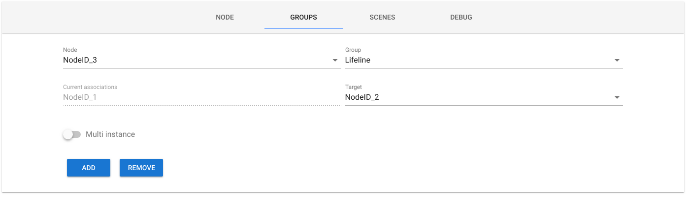

[](http://makeapullrequest.com)
[](https://opensource.org/licenses/mit-license.php)


**TO**


# Zwave To MQTT

Fully configurable Zwave to MQTT **Gateway** and **Control Panel**.

- **Backend**: NodeJS, Express, socket.io, Webpack
- **Frontend**: Vue,  socket.io, [Vuetify](https://github.com/vuetifyjs/vuetify)

**DEVELOPMENT IN PROGRESS, ANY CONTRIBUTION AND BUG REPORT IS WELCOME**

## Installation :electric_plug:

1. Firstly you need to install [Open-Zwave](https://github.com/OpenZWave/open-zwave) library on your system.

  If you are using Ubuntu:

  ```sh
  sudo apt-get install libudev-dev
  cd ~
  wget http://old.openzwave.com/downloads/openzwave-1.4.1.tar.gz
  tar zxvf openzwave-*.gz
  cd openzwave-* && make && sudo make install
  export LD_LIBRARY_PATH=/usr/local/lib64
  sudo sed -i '$a LD_LIBRARY_PATH=/usr/local/lib64' /etc/environment
```

  For Raspberry check [here](https://github.com/OpenZWave/node-openzwave-shared/blob/master/README-raspbian.md#2-install-the-open-zwave-library-on-your-raspberry)

2. Test the library: go to openzwave directory `cd openzwave-*` and run the command

  `MinOZW /dev/ttyACM0`

  > replace `/dev/ttyACM0` with the USB port where your controller is connected

3. Now you can use the packaged version or clone this repo and build the project:
  1. For the packaged version:
     ```sh
     cd ~
     mkdir Zwave2Mqtt
     cd Zwave2Mqtt
     wget https://github.com/robertsLando/Zwave2Mqtt/files/2811961/zwave2mqtt-v1.0.0.zip
     unzip zwave2mqtt-v1.0.0.zip
     DEBUG=z2m:* ./zwave2mqtt

     ```
  2. If you want to compile last code from github:

    ```sh
    git clone https://github.com/robertsLando/Zwave2Mqtt.git
    cd Zwave2Mqtt
    npm install
    npm run build
    npm start
    ```
    - Open the browser http://localhost:8091

## Development :nerd_face:

Developers who wants to debug the application have to open 2 terminals.

In first terminal run `npm run dev` to start webpack-dev for front-end developing and hot reloading at http://localhost:8092
(**THE PORT FOR DEVELOPING IS 8092**)

In the second terminal run `npm run dev:server` to start the backend server with inspect and auto restart features (if you don't have nodemon installed: `npm install -g nodemon`)

To package the application run `npm run pkg` command and follow the steps

## Usage :wrench:

Firstly you need to open the browser at the link http://localhost:8091 and edit the settings for Zwave, MQTT and the Gateway.

#### Zwave

Zwave settings:

- **Serial port**: The serial port where your controller is connected
- **Network key** (Optional): Zwave network key if security is enabled
- **Logging**: Enable/Disable Openzwave Library logging
- **Save configuration**: Store zwave configuration in `zwcfg_<homeHex>.xml` and `zwscene.xml` files this is needed for peristent node information like node name and location
- **Poll interval**: Interval in milliseconds between polls


#### MQTT

Mqtt settings:

- **Name**: A unique name that identify the Gateway.
- **Host**: The url of the broker
- **Port**: Broker port
- **Reconnect period**: Milliseconds between two reconnection tries
- **Prefix**: The prefix where all values are published
- **QoS**: Quality Of Service (check MQTT specs) of outgoing packets
- **Retain**: The retain flag of outgoing packets
- **Clean**: Sets the clean flag when connecting to the broker
- **Store**: Enable/Disable persistent storage of packets (QoS > 0). If disabled in memory storage will be used but all packets stored in memory are lost in case of shutdowns or unexpected errors.
- **Auth**: Enable this if broker requires auth. If so you need to enter also a valid **username** and **password**.

#### Gateway

Gateway settings:

- **Gateway type**: This setting specify the logic used to publish Zwave Nodes Values in MQTT topics. At the moment there are 3 possible configuration, two are automatic (all values are published in a specific topic) and one allows to manually configure which values you want to publish for each device type:

  1. **ValueId Topics**: *Automatically configured*. The topic where zwave values are published will be:

  `<mqtt_prefix>/<?node_location>/<node_id>/<class_id>/<instance>/<index>`

    - `mqtt_prefix`: the prefix set in Mqtt Settings
    - `node_location`: location of the Zwave Node (optional, if not present will not be added to the topic)
    - `node_id`: the unique numerical id of the node in Zwave network
    - `class_id`: the numerical class id of the value
    - `instance`: the numerical value of value instance
    - `index`: the numerical index of the value


  2. **Named Topics**: *Automatically configured*. The topic where zwave values are published will be:

  `<mqtt_prefix>/<?node_location>/<node_name>/<class_name>/<value_label>`

    - `mqtt_prefix`: the prefix set in Mqtt Settings
    - `node_location`: location of the Zwave Node (optional, if not present will not be added to the topic)
    - `node_name`: name of the node, if not set will be `nodeID_<node_id>`
    - `class_name`: the node class name corrisponding to given class id or `unknownClass_<class_id>` if the class name is not found
    - `value_label`: the zwave value label (lower case and spaces are replaced with `_`)


  3. **Configured Manually**: *Needs configuration*. The topic where zwave values are published will be:

  `<mqtt_prefix>/<?node_location>/<node_name>/<value_topic>`

    - `mqtt_prefix`: the prefix set in Mqtt Settings
    - `node_location`: location of the Zwave Node (optional, if not present will not be added to the topic)
    - `node_name`: name of the node, if not set will be `nodeID_<node_id>`
    - `value_topic`: the topic of the value. This is manually configured in Gateway settings by popolating a table with the values that I want to read from each device of a specific type in my network. Once scan is complete, the gateway creates an array with all devices types found in the network. A device has a `device_id` that is unique, it is composed by this node properties: `<manufacturerid>-<productid>-<producttype>`.

- **Payload type**: The content of the payload when an update is published:
  - **JSON Time-Value**: The payload will be a JSON object like:

    ```json
    {
      "time": 1548683523859,
      "value": 10
    }
    ```

  - **Entire Zwave value Object**
  The payload will contain all info of a value from Zwave network:

    ```json
    {
      "value_id": "3-64-1-0",
      "node_id": 3,
      "class_id": 64,
      "type": "list",
      "genre": "user",
      "instance": 1,
      "index": 0,
      "label": "Mode",
      "units": "",
      "help": "",
      "read_only": false,
      "write_only": false,
      "min": 0,
      "max": 0,
      "is_polled": false,
      "values": ["Off", "Heat (Default)", "Cool", "Energy Heat"],
      "value": "Off",
    }
     ```
  - **Just value**: The payload will contain only the row Numeric/String value

- **Send 'list' as integer**: Zwave 'list' values are sent as list index instead of string values


Once finished press `SAVE` and gateway will start Zwave Network Scan, than go to 'Control Panel' section and wait until the scan is completed to check discovered devices and manage them.

Settings, scenes and Zwave configuration are stored in `JSON/xml` files that you can easily **import/export** for backup purposes.

By default Node status (`true` if node is ready `false` if node is dead) will be published in:

`<mqtt_prefix>/<?node_location>/<node_name>/status`


## Features :star:

- Configurable Zwave to Mqtt Gateway
- Zwave Control Panel:
  - **Nodes management**: check nodes status in the network, change nodes `name` and `location`, get nodes values and configure them, send actions to controller and import/export zwave configuration files
  - **Groups associations**: create associations between nodes (also supports multi-instance associations, need to use last version of openzwave-shared)
  - **Custom scenes management**: (OpenZwave-Shared scenes management has actually some bugs and it's limited so I have made a custom scenes implementation that uses the same APIs but stores values in a JSON file that can be imported/exported and also allows to set a timeout to a value in a scene)
- Log debug in UI


## MQTT APIs :gift:

You have full access to all [Openzwave-Shared APIs](https://github.com/OpenZWave/node-openzwave-shared/blob/master/README-api.md) (and more) by simple usign MQTT.

#### Zwave APIs

To call a Zwave API you just need to publish a JSON object like:

```json
{
  "args": [2,1]
}
```

Where `args` is an array with the args used to call the api, the topic is:

`<mqtt_prefix>/_CLIENTS/ZWAVE_GATEWAY-<mqtt_name>/api/<api_name>/set`

The result will be publised on the same topic without `/set`

Example: If I publish the previous json object to the topic

`zwave/_CLIENTS/ZWAVE_GATEWAY-office/api/getAssociations/set`

I will get this response (in the same topic without the suffix `/set`):

```json
{
  "success":true,
  "message":"Success zwave api call",
  "result":[1]
}
```

`result` will contain the value returned from the API. In this example I will get an array with all node IDs that are associated to the group 1 (lifeline) of node 2.

#### Set values

To write a value using MQTT you just need to send the value to set in the same topic where the value updates are published by adding the suffix `/set` to the topic (**READONLY VALUES CANNOT BE WRITE**).

Example with gateway configured with `named topics`:

If I publish the value `25.5` (also a payload with a JSON object with the value in `value` property is accepted) to the topic

`zwave/office/nodeID_4/thermostat_setpoint/heating/set`

I will set the Heating setpoint of the node with id `4` located in the `office` to `25.5`. To check if the value has been successfully write just check when the value changes on the topic:

`zwave/office/nodeID_4/thermostat_setpoint/heating`

#### Broadcast

You can send broadcast values to *all devices of a certain type* in the network (actually this only works with manually configured gateway).

Broadcast API is accessible from:

`<mqtt_prefix>/_CLIENTS/ZWAVE_GATEWAY-<mqtt_name>/broadcast/<value_topic>/set`

- `value_topic`: the topic of this value configured in gateway settings (value must have the flag `isBroadcast` set to true).

It works like the set value API without the node name and location properties.
If the API is correctly called the same payload of the request will be published
to the topic without `/set` suffix.

## Screenshots :camera:

#### Settings


#### Control Panel


#### Groups associations



#### Scenes


#### Debug


## TODOs :pencil:

- [x] Better logging
- [ ] Dockerize application
- [x] Package application with PKG
- [ ] Add unit test


## Author :bowtie:

[Daniel Lando](https://github.com/robertsLando)

Support me on [Patreon](https://www.patreon.com/join/2409916) :heart:
