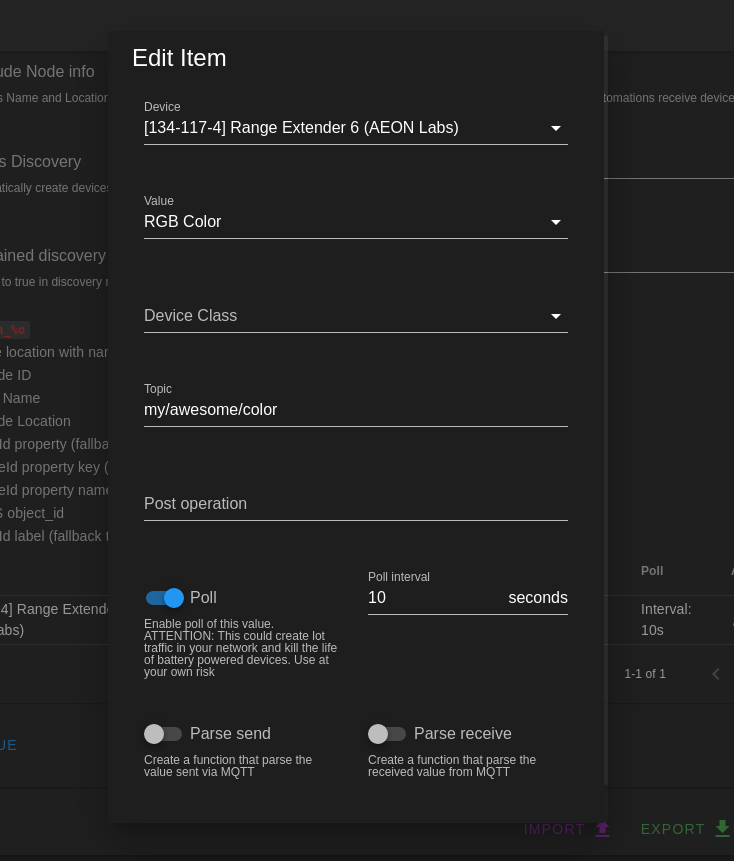

# Polling Legacy Z-Wave Devices

Some legacy devices don't report all of their values automatically and require polling to automatically update their values. Some platforms poll such devices automatically whether you need them polled or not. Because such polling can have detrimental effects on your mesh network, Z-Wave JS does not poll devices by default. Polling can quickly lead to network congestion and should be used very sparingly and only where necessary.

zwave-js-ui allows you to configure scheduled polling on a per-value basis, which you can use to keep only the values that you need updated. It also allows you to poll individual values on-demand from your automations, which should be preferred over blindly polling all of the time, if possible.

> [!NOTE]
> Sometimes polling one value will result in multiple related values being returned together as a group. For example `targetValue`, `currentValue` and `duration` must be polled together for most of the switch-type CCs. Polling multiple values of the same group can result in unnecessary traffic on the Z-Wave mesh. To avoid this scenario, you should test polling each value while watching the log file to determine whether other values are also returned.

In order to enable polling of specific values you need to go to the Settings page, expand the General section and add a new value to the Device values configuration table.

Press `NEW VALUE` to add a new value or on the `Pen Icon` in the actions column of the table to open the dialog to edit a pre-existing value. Select the device, the valueId, enable the `Enable Poll` flag and set a `Poll interval` in seconds:

Press `SAVE` to upload your new settings to the server and it will automatically handle the polling based on your settings.
