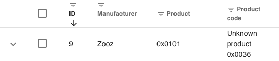

# Device Support

## Supported Devices

A database of currently supported devices is [available](https://devices.zwave-js.io/). This database is updated automatically with each release.

## "Unknown" Devices

If you include a device for which we do not have a device configuration file, that device will be described as "unknown" in the UI.

> [!TIP]
> **Do not panic! It probably still works just fine.**

Historically (with other platforms), a missing device configuration file meant that a device would not function. With Z-Wave JS, device functionality is setup automatically for almost all modern devices through the device interview. As such, **you do not need to be concerned** with the fact that a device is labeled as an "Unknown" device. That merely means that we don't know what to call it and we haven't yet made the available configuration parameters prettier.

If the "unknown" label bothers you, you can either [submit a device file](https://zwave-js.github.io/node-zwave-js/#/config-files/contributing-files) yourself, request that [we add the device file](https://github.com/zwave-js/node-zwave-js/issues/new?assignees=&labels=config+%E2%9A%99&template=device_config.yml&title=Missing+device+configuration%3A+%3Center+manufacturer+and+device+name%3E) (when we get time), or, if absolutely necessary, you can run a [custom device file](device-support/custom-device-files.md).
