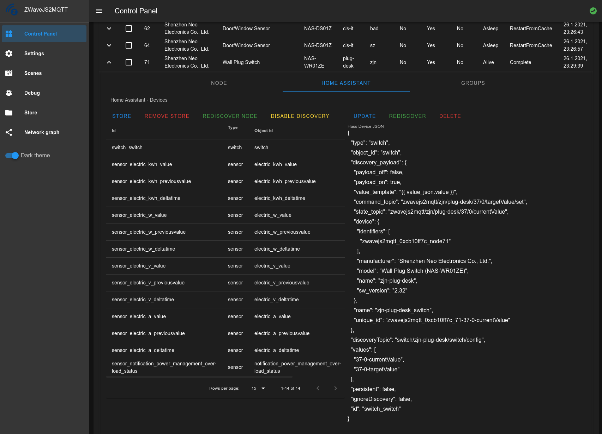

# Home Assistant integration (BETA)

**At least Home Assistant >= 0.84 is required!**

The easiest way to integrate zwavejs2mqtt with Home Assistant is by
using [MQTT discovery](https://www.home-assistant.io/docs/mqtt/discovery/).
This allows zwavejs2mqtt to automatically add devices to Home Assistant.
To enable this feature remember to set the flag **Hass Discovery** in Gateway settings configuration.

> [!WARNING]
> Hass updates often break zwavejs2mqtt device discovery. For this reason zwavejs2mqtt will try to be always compatible with latest hass version. Check the changelog before update!

To achieve the best possible integration (including MQTT discovery):

- In your **zwavejs2mqtt** gateway settings enable `Homeassistant discovery` flag and enable the MQTT **retain** too. The retain flag for MQTT is suggested to be sure that, once discovered, each device get the last value published (otherwise you have to wait for a value change)

**NB:** Starting from version `4.0.0` the default Birth/Will topic is `homeassistant/status` in order to reflect defaults birth/will of Hass `0.113`

- In your **Home Assistant** `configuration.yaml`:

```yaml
mqtt:
  discovery: true
  discovery_prefix: <your_discovery_prefix>
  broker: [YOUR MQTT BROKER] # Remove if you want to use builtin-in MQTT broker
  birth_message:
    topic: 'homeassistant/status'
    payload: 'online'
  will_message:
    topic: 'homeassistant/status'
    payload: 'offline'
```

Mind you that if you want to use the embedded broker of Home Assistant you
have to [follow this guide](https://www.home-assistant.io/docs/mqtt/broker#embedded-broker).

zwavejs2mqtt is expecting Home Assistant to send it's birth/will
messages to `homeassistant/status`. Be sure to add this to your `configuration.yaml` if you want
zwavejs2mqtt to resend the cached values when Home Assistant restarts.

zwavejs2mqtt try to do its best to guess how to map devices from Zwave to HASS. At the moment it try to guess the device to generate based on zwave values command classes, index and units of the value. When the discovered device doesn't fit your needs you can you can set custom a `device_class` to values using Gateway value table.

## Accessing zwavejs2mqtt From Within Home Assistant

The zwavejs2mqtt Control Panel UI can be accessed from within Home Assistant by adding a panel to a Lovelace dashboard using the Raw Configuration Editor, substituting your IP address.

First, add a new Lovelace dashboard. In the dashboard:

1. Click on the top right and 'Edit Dashboard'.
2. Turn on the "Start with an empty dashboard" switch, then click "Take Control"
3. Click on the top right, and then select "Raw configuration editor"
4. Paste the code below and save

```yaml
- title: zwavejs2mqtt
  panel: true
  cards:
    - type: iframe
      url: 'http:/127.0.0.1[SUBSTITUTE YOUR IP ADDRESS HERE]:8091/'
      aspect_ratio: 100%
```

Alternatively, you can add a new tab to a pre-existing dashboard by inserting the above yaml into the pre-existing dashboard's raw configuration.

## Components management

To see the components that have been discovered by zwavejs2mqtt go to Control Panel UI, select a Node from the Nodes table then select the Node tab from tabs menu at the bottom of Nodes table. Now at the Bottom of the page, after Node values section you can find a new section called `Home Assistant - Devices`. Here you will see a table with all devices created for the selected node.



**ATTENTION**
Once edited the devices will loose all their customizations after a restart. To prevent this you can store the node hassDevices by pressing `STORE` button at the top of hass devices table. By pressing it the hassDevices will be stored in `nodes.json` file that can be imported/exported easily from control panel UI at the top of nodes table.

### Rediscover Node

If you update node name/location you have to also rediscover values of this node as they may have wrong topics. To do this press on `REDISCOVER NODE` green button on top of **Home Assistant - Devices** table (check previous picture)

### Edit existing component

If you select a device it's configuration will be displayed as a JSON object on the right. With the selected device you can edit it and send some actions:

- `Update`: Update in-memory hass device configuration
- `Rediscover`: Re-discover this device using the `discoveryTopic` and `discovery_payload` of the configuration
- `Delete`: Delete the device from Hass entities of selected node

### Add new component

If no device is selected you can manually insert a device JSON configuration. If the configuration is valid you can press the button `Add` to add it to devices. If the process complete successfully the device will be added to the Hass Devices table and you can now select it from the table and press on `Rediscover` to discover your custom device

## Custom Components

At the moment auto discovery just creates components like `sensor`, `cover` `binary_sensor` and `switch`. For more complex components like `climate` and `fan` you need to provide a configuration. Components configurations are stored in `hass/devices.js` file. Here are contained all components that zwavejs2mqtt needs to create for each Zwave device type. The key is the Zwave **device id**(`<manufacturerid>-<productid>-<producttype>`) the value is an array with all HASS components to create for that Zwave Device.

To get the **Device id** of a specific node go to Control Panel, select a node in the table and select the Node tab, it will be displayed under Node Actions dropdown menu.

You can specify your custom devices configuration inside `store/customDevices(.js|.json)` file. This allows users that use Docker to create their custom hass devices configuration without the need to build a new container. If using `.json` format zwavejs2mqtt will watch for file changes and automatically load new components on runtime without need to restart the application.

> [!NOTE]
> ONCE YOU SUCCESSFULLY INTEGRATE NEW COMPONENTS PLEASE SEND A PR!

### Thermostats

```js
{
  type: 'climate',
  object_id: 'thermostat',
  values: [
    '64-0-mode',
    '49-0-Air temperature',
    '67-0-setpoint-1',
    '67-0-setpoint-2'
  ],
  mode_map: { off: 0, heat: 1, cool: 2 },
  setpoint_topic: {
    1: '67-0-setpoint-1',
    2: '67-0-setpoint-2'
  },
  default_setpoint: '67-0-setpoint-1',
  discovery_payload: {
    min_temp: 15,
    max_temp: 30,
    modes: ['off', 'heat', 'cool'],
    mode_state_topic: '64-0-mode',
    mode_command_topic: true,
    current_temperature_topic: '49-0-Air temperature',
    current_temperature_template: '{{ value_json.value }}',
    temperature_state_template: '{{ value_json.value }}',
    temperature_command_topic: true
  }
}
```

- **type**: The hass [MQTT component](https://www.home-assistant.io/components/mqtt/) type
- **object_id**: The unique id of this object (must be unique for the device)
- **values**: Array of values used by this component
- **mode_map**: Key-Value object where keys are [MQTT Climate](https://www.home-assistant.io/components/climate.mqtt/) modes and values are the matching thermostat modes values
- **setpoint_topic**: Key-Value object where keys are the modes of the Zwave thermostat and values are the matching setpoint `value id` (use this if your thermostat has more than one setpoint)
- **default_setpoint**: The default thermostat setpoint.
- **discovery_payload**: The payload sent to hass to discover this device. Check [here](https://www.home-assistant.io/integrations/climate.mqtt/) for a list with all supported options
  - **min_temp/max_temp**: Min/Max temperature of the thermostat
  - **modes**: Array of Hass Climate supported modes. Allowed values are `[“auto”, “off”, “cool”, “heat”, “dry”, “fan_only”]`
  - **mode_state_topic**: `value id` of mode value
  - **current_temperature_topic**: `value id` of current temperature value
  - **current_temperature_template/temperature_state_template**: Template used to fetch the value from the MQTT payload
  - **temperature_command_topic/mode_command_topic**: If true this values are subscribed to this topics to send commands from Hass to change this values

Thermostats are most complex components to create, in this device example the setpoint topic changes based on the mode selected. zwavejs2mqtt handles the mode changes by updating the device discovery payload to match the correct setpoint based on the mode selected.

### Fans

```js
{
  type: 'fan',
  object_id: 'dimmer',
  values: ['38-0-currentValue', '38-0-targetValue'],
  discovery_payload: {
    command_topic: '38-0-targetValue',
    speed_command_topic: '38-0-targetValue',
    speed_state_topic: '38-0-currentValue',
    state_topic: '38-0-currentValue',
    speeds: ['off', 'low', 'medium', 'high'],
    payload_low_speed: 24,
    payload_medium_speed: 50,
    payload_high_speed: 99,
    payload_off: 0,
    payload_on: 255,
    state_value_template:
      ' 0  255 ',
    speed_value_template:
      ' 0  24  50  99 '
  }
}
```

- **type**: The hass [MQTT component](https://www.home-assistant.io/components/mqtt/) type
- **object_id**: The unique id of this object (must be unique for the device)
- **values**: Array of values used by this component
- **discovery_payload**: The payload sent to hass to discover this device. Check [here](https://www.home-assistant.io/integrations/fan.mqtt/) for a list with all supported options
  - **command_topic**: The topic to send commands
  - **state_topic**: The topic to receive state updates
  - **speed_command_topic**: The topic used to send speed commands
  - **state_value_template**: The template used to set the value ON/OFF based on the payload received
  - **speed_value_template**: The template to use to set the speed `["off", "low", "medium", "high"]` based on the payload received

### Thermostats with Fans

The main template is like the thermostat template. The things to add are:

```js
{
  type: 'climate',
  object_id: 'thermostat',
  values: [
    '49-0-Air temperature',
    '64-0-mode',
    '66-0-state', // <-- add fan values
    '67-0-setpoint-1',
    '67-0-setpoint-2',
    '68-0-mode' // <-- add fan values
  ],
  mode_map: {
    off: 0,
    heat: 1,
    cool: 2
  },
  fan_mode_map: { // <-- add fan mode_map
    auto: 0,
    on: 1
  },
  setpoint_topic: {
    Heat: '67-0-setpoint-1',
    Cool: '67-0-setpoint-2'
  },
  default_setpoint: '67-0-setpoint-1',
  discovery_payload: {
    min_temp: 50,
    max_temp: 85,
    modes: ['off', 'heat', 'cool'],
    fan_modes: ['auto', 'on'], // <-- add fan supported modes
    action_topic: '66-0-state',
    action_template: '{{ value_json.value | lower }}',
    current_temperature_topic: '49-0-Air temperature',
    current_temperature_template: '{{ value_json.value }}',
    fan_mode_state_topic: '68-0-mode', // <-- add fan state topic
    fan_mode_command_topic: true, // <-- add fan command topic
    mode_state_topic: '64-0-mode',
    mode_command_topic: true,
    temperature_state_template: '{{ value_json.value }}',
    temperature_command_topic: true
  }
}
```

## Manually create entities

When mqtt auto discovery and custom components aren't enough for your needs you can choose to manually create your entities in hass.

### Execute scene

If you need to create a switch that triggers a scene activation (using mqtt apis) you can use this example.

Add the following entriy in the `configuration.yaml`. Replace `<mqtt_prefix>` and `<mqtt_name>` with your values, based on your mqtt settings and `<sceneId>` with the scene you want to activate

```yaml
switch:
  - platform: mqtt
    name: Doorbell Scene
    unique_id: zwavedoorbellscene
    command_topic: '<mqtt_prefix>/_CLIENTS/ZWAVE_GATEWAY-<mqtt_name>/api/_activateScene/set'
    payload_on: '{ "args": [ <sceneId> ] }'
```

## Troubleshooting

### Removing or resetting HASS entities

If needed, it is possible to remove and reset entities added to HASS via MQTT discovery. These documents are pushed via MQTT with the `Retained` flag set, so even if an entity disappears from **zwavejs2mqtt**, it still remains in HASS.

To remove an entity in HASS, you simply need to remove the retained message in the HASS discovery topics, by default `homeassistant/..`.

This can be done with [MQTT Explorer](http://mqtt-explorer.com/) or CLI tools like [`mosquitto_pub`](https://mosquitto.org/man/mosquitto_pub-1.html).

Note that in order for a removed entity to appear again, it must be published by **zwavejs2mqtt** again. This happens automatically for new devices, if enabled, alternatively it can be done manually by selecting the node in **zwavejs2mqtt**, and then for each HASS device clicking `Rediscover Node`.
