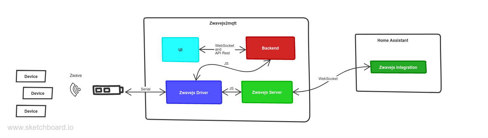

# Home Assistant Using the Official Integration

To integrate your Z-Wave components you can use either the official Home Assistant [Z-Wave JS integration](https://www.home-assistant.io/integrations/zwave_js) and/or MQTT discovery.

## Z-Wave JS integration

Home Assistant has an integration for zwave which is based on zwave-js - you can read more about this at the [Z-Wave JS integration](https://www.home-assistant.io/integrations/zwave_js) docs.

To enable the integration:

1. Open Zwave-js-ui settings page
2. Enable the "WS Server" setting in the "Home Assistant" tab
3. If you do not need the MQTT features, you can [Disable MQTT Gateway](/usage/setup?id=disable-gateway) and use Z-Wave JS UI as an additional user interface to control your Z-Wave network.
4. Configure the ZWave JS Integration in Home Assistant, by following [the official docs](https://www.home-assistant.io/integrations/zwave_js)

Once this has been configured, entities should automatically be created in HA.

### Assistance with the Official Integration

Should you need support with the official Home Assistant Integration, please consult that project's [documentation](https://www.home-assistant.io/integrations/zwave_js/).

Support tickets relating to Home Assistant should first be submitted to the Home Assistant [project](https://github.com/home-assistant/core), who will redirect the ticket to Z-Wave JS if need be.

## MQTT Discovery

To configure this method, you need an MQTT server in addition to the other components.

1. Set up the MQTT server, for example using the well known Mosquitto server
2. Open Zwave-js-ui settings page
3. Configure the MQTT server information under the "MQTT" tab
4. Enable "MQTT Discovery", in the "Home Assistant" tab

## How it works

The following diagram shows the flow of data from the Z-Wave network to the Home Assistant application.

