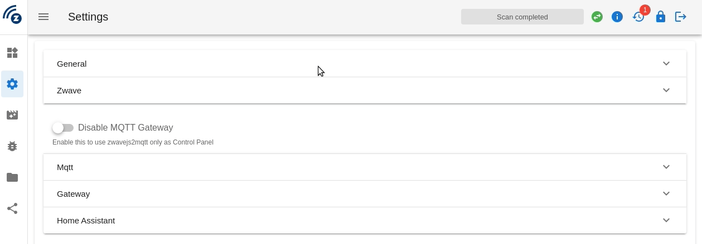
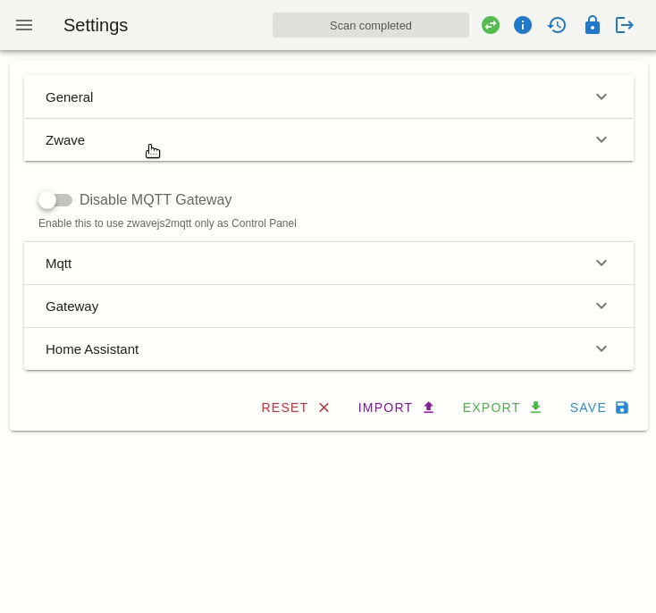
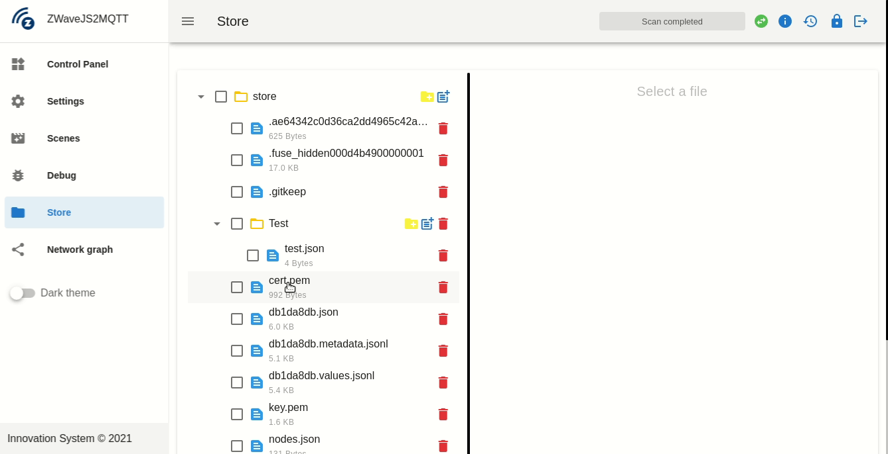

# Bug Report

When something isn't working as expected you should [open an issue](https://github.com/zwave-js/zwavejs2mqtt/issues/new/choose) on Github. To help us debug your issue you should provide all available information like logs and a node export, if needed.

## Export Logs

The are two main loggers, one for Zwavejs2Mqtt and one for the Z-Wave JS module. To help us find out what's going on, you should attach the logs coming from both loggers when reporting a bug.

Both logger options are configured from the `Settings` page.

### Application logs

Zwavejs2Mqtt logger can be configured in `General` section, enable `Log enabled` switch and `Log To File` and set `Log Level` to `Silly`

> Log file name: `zwavejs2mqtt.log`

### Driver logs

Driver logger can be configured in `Z-Wave` section, enable `Log enabled` switch and `Log To File` and set `Log Level` to `Silly`

> Log file name: `zwavejs_<date>.log`

### Download Zip

Your logs will be stored in separate files inside the `store` folder.

You can easily download a zip file with the logs files from the `Explorer` view on the UI. Just select the files you want to export , press on the fab button on the bottom right corner and press the download icon. Remember to attach the zip file to your issue.

## Export node.json

Each node in Home Assistant has an Export button, which will export all data for that node. To perform that export, follow this guide.

1. Select the node from the UI
2. Click on the advanced button
3. Select `Export Json`
4. Grab the file and attach it on your github Issue

You can also export all nodes, just press on the `Advanced` button on the top of control panel table and click on `Export` under `Dump`

This is mostly useful when there are issue with Home Assistant MQTT discovery or the mesh graph.
