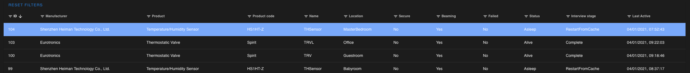
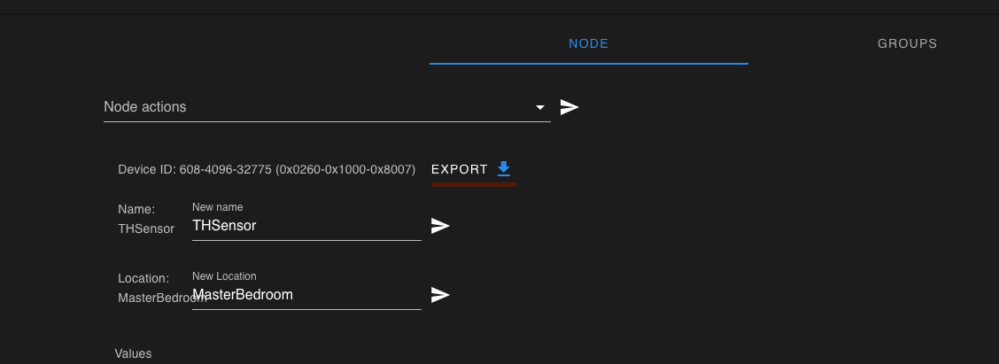
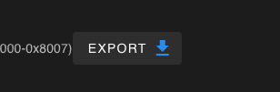

# Report a Node Bug

When it comes to node issues, it is best to export specific information, which can help us debug and help with the problem

## Export node json

Each node hass an Export button, this will export all data of this specific node. To perform this export, use our screen shots and steps as your guide.

### Select node from your webinterface

Selecting the node as showing in the image.

Will result showing you more details of the node at the bottom of your interface.

### export Node json

Exporting is just a button away, click on export shown on screenshot! this will generate a json of this specific node.

### Grab the file and attach it on your github Issue

Simple as that!
