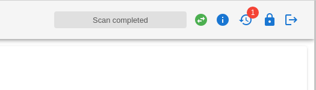
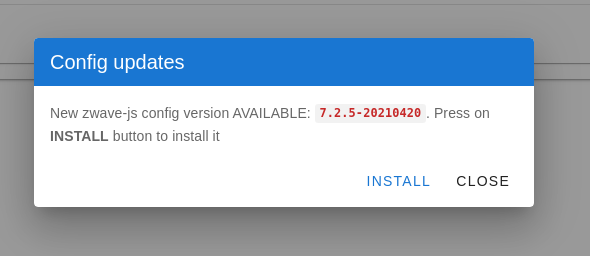

# Config DB Updates

Since version 4.0.0 it is possible to update the internal zwave-js device config database on the fly directly from the zwavejs2mqtt UI, without updating the entire docker container.

Updates are checked everyday at midnight, but you can also check for new updates manually from the UI by clicking on the icon in the top right corner. When an update is available a badge will show up next to the icon:

When you click on the icon, if there is an update available, a dialog like this is shown:

Press on `INSTALL` and wait until you receive feedback. If the update fails, check logs to see more detail about the error(s). If there are no updates available you will see a `CHECK` button instead of `INSTALL`.

## Inside docker containers

By default config updates work by checking the installed version of the module `@zwave-js/config`. Doing such updates inside docker containers requires volumes in order to keep them consistent. Therefore, when running on docker zwave-js will copy the embedded config DB into the `store/.config-db` folder. This folder is not visible/editable from the store ui and should not be altered. If needed, the folder path can be customized using the `ZWAVEJS_EXTERNAL_CONFIG` env var, check related [docs](/guide/env-vars) for more info.

> [!NOTE] You must re-interview a device for many types of changes in the device file to have an effect. E.g. changed configuration parameters, certain compat flags, etc.
