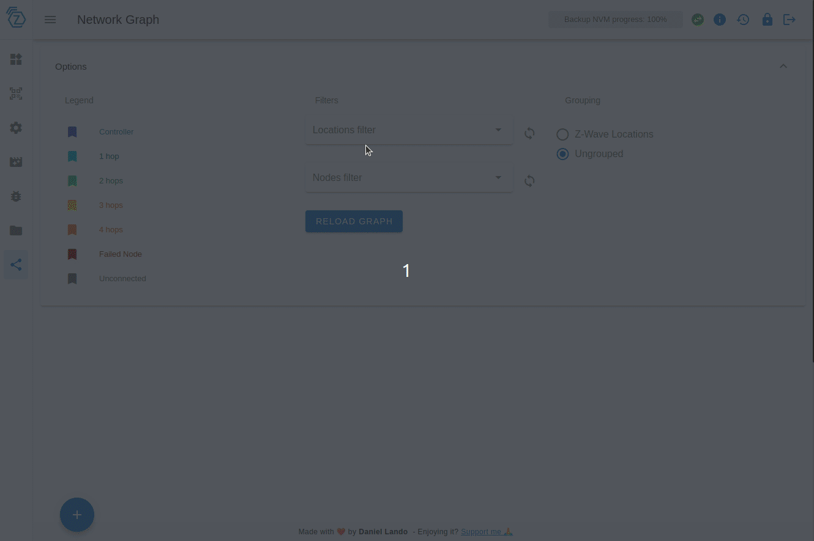

# Network graph

Network graph allows you to visualize your Zwave mesh network and check connectivity issues between nodes and the controller.

## Nodes Healthcheck

In order to use this feature you need to open **Network Graph** tab, apply some filters in case you have big graph to only see required nodes and then click on `Reload Graph`. At this point you can see your nodes and how them are connected to the controller.

By clicking on nodes like you see in previous gif a panel will open showing you all node informations and last working route informations (if available). At the bottom of this panel there is a button `CHECK HEALTH` that opens a dialog that allows to perform health checks on that node.

Depending on if the target node is the controller or a normal node the UI will perform a `lifeline healtcheck` or a `route healthcheck`.

In the example above we have checked the health of the node against the controller node (lifeline healthcheck). Route healthcheck results are a bit different:

If you have problems understanding the results just open the info dialog by pressing on the `?` button and you will see a detailed explanation of the results, them are also available [here](https://zwave-js.github.io/node-zwave-js/#/api/node?id=checklifelinehealth).
