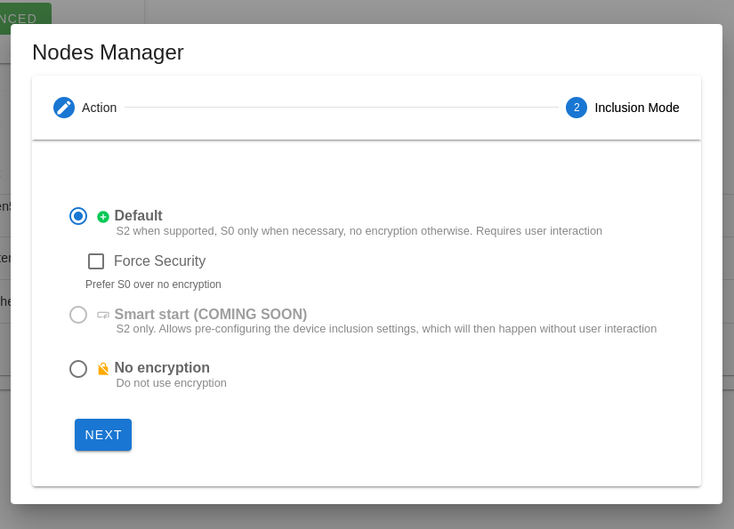

# Managing Nodes

Nodes can be managed from the Control Panel page by clicking on bottom right FAB `+` and then `∞` button. This will open the **Node Manager** dialog

> [!NOTE]
> In order to include secure devices, you must setup the **SECURITY KEYS** in Z-Wave settings.

## Add a node

1. Select `Inclusion` and press `NEXT`
2. Select the inclusion mode. We suggest using `Default` or `Smart start`). Then press `NEXT`.
3. Put your device in `Inclusion mode` (check your device manual for instructions).
4. If the selected mode is `Default`, the next steps will depend on the device you are including. If it supports S0/S2 security you will be asked to select the security classes to grant and, if the device requires it, the DSK pin code. If the process completes without errors you will see a message saying that the node has been added and which security class was used.

## Remove a node

1. Select `Exclusion` and press `NEXT`.
2. Put your device in `Exclusion mode` (check your device manual for instructions).
3. If the process completes without errors you will see a message saying the node has been removed successfully.

## Replace failed node

Like `Remove Failed Node`, this can only succeed if the node to be replaced:

- has a status of **Dead**, **Asleep**, or **Unknown**
- does not respond to a ping

1. Select `Replace Failed Node` and press `NEXT`
2. Select the node you want to replace in the dropdown menu. If the node is not listed you can manually write the node id. Once done press `NEXT`
3. Select the inclusion mode. If your device supports it, we recommend S2 security. If not, use no encryption. Use S0 security only if necessary (for example for old lock devices) as S0 security increases the amount of mesh traffic on the network.
4. Put your device in `Inclusion mode` (check your device manual for instructions).
5. If the selected mode is `S2` you will be asked to select the security classes in the next steps, and to enter the DSK pin code, if applicable. If all the process completes without errors you will see a message saying the node has been added and which security class was used.

## Example

