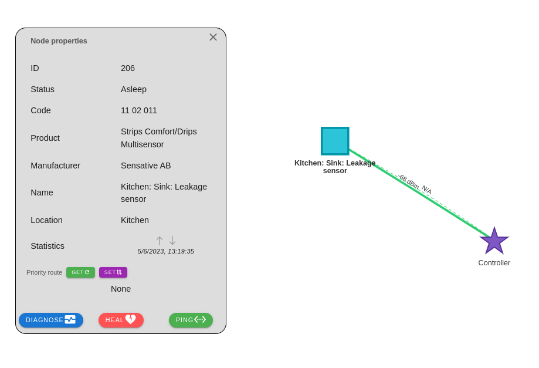
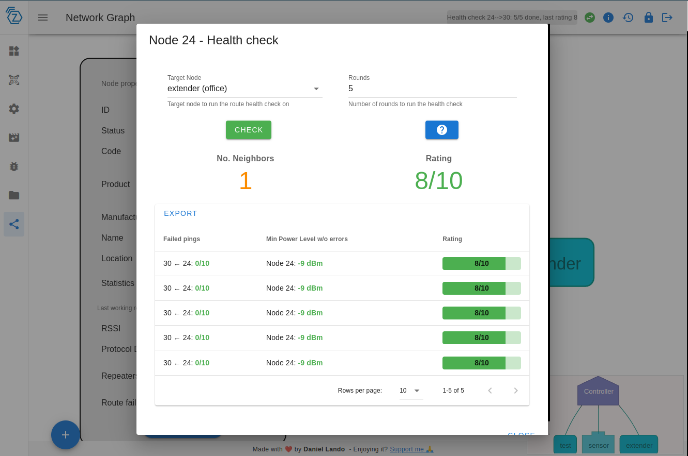

# Nodes Healthcheck

In order to use this feature you need to open **Network Graph** tab, here you can visualize your Z-Wave mesh network and check connectivity issues between nodes and the controller.

Starting from 8.17.0 version Network Graph shows nodes connection based on known routes instead of using neighbors informations as before. This allows to show more accurate connections between nodes. Each node has 3 routes:

- **Priority route**: set by the user, it's the first route the controller tries
- **Last working route**: the last route that worked for the node
- **Next to last working route**: the next route that will be tried if the last working route fails

By clicking on nodes a panel will open containing more detailed node information. At the bottom of this panel there is a button `DIAGNOSE` that opens a dialog that allows to perform health checks on that node.

When the target node is the controller, this check will be a **Lifeline healthcheck**, for other nodes a **Route healthcheck**.

In the example above we have checked the health of the node against the controller node (lifeline healthcheck). Route healthcheck results contain less information, some of which depends on what the node supports:

If you have problems understanding the results, just open the info dialog by pressing on the `?` button and you will see a detailed explanation of the results. This explanation is also available [here](https://zwave-js.github.io/node-zwave-js/#/api/node?id=checklifelinehealth).
