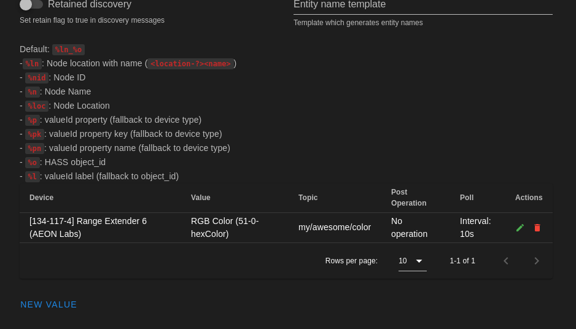

# Setup

To configure Z-Wave JS UI, you must access it via your web browser at <http://localhost:8091> on the machine on which it was run, or at the IP address of your remote installation on port 8091.

## General

- **Auth**: Enable this to password protect your application. Default credentials are:
  - Username:`admin`
  - Password: `zwave`
- **HTTPS**: Enable this to serve the UI over HTTPS (Requires app reload). **Requires openssl to be installed on the machine.**
- **Plugins**: List of plugins to use. If the plugin you want to use is not listed just write the name or the path to it and press enter. More about plugins [here](/guide/plugins)
- **Log enabled**: Enable logging for Z-Wave JS UI
- **Log level**: Set the log level (Error, Warn, Info, Verbose, Debug, Silly)
- **Log to file**: Enable this to store the logs to a file
- **Disable changelog**: Disable the changelog popup on new releases
- **Notify on new releases**: Enable this to receive a notification when a new release is available

### Device values configuration

The Device values configuration table can be found under [General](#general) section and can be used to create valueIds specific configurations for each device. This means that if you create an entry here this configuration will be applied to all device of the same type in your Network.



> [!NOTE]
> In order to appear in the dropdown list a device must have completed its interview so if you don't find it there please wait for the interview to complete.
> If the device is battery-powered, try to manually wake up it

Properties of a **valueId configuration**:

- **Device**: The device type. Once the scan is complete, the gateway creates an array with all devices types found in the network. A device has a `device_id` that is unique, it is composed by this node properties: `<manufacturerid>-<productid>-<producttype>`.
- **Value**: The valueId you want to configure
- **Device Class**: If the value is a multilevel sensor, a binary sensor, or a meter you can set a custom `device_class` to use with Home Assistant discovery. Check [sensor](https://www.home-assistant.io/components/sensor/#device-class) and [binary sensor](https://www.home-assistant.io/components/binary_sensor/#device-class)
- **Topic**: The topic to use for this value. It is the topic added after topic prefix, node name and location. If gateway type is different than `Manual` this will be ignored
- **QoS**: If specified, overrides MQTT settings QoS level
- **Retain**: If specified, overrides MQTT settings retain flag
- **Post operation**: If you want to convert your value (valid examples: '/10' '/100' '*10' '*100')
- **Parse send**: Enable this to allow users to specify a custom `function(value,valueId,node,logger)` to parse the value sent to MQTT. The function must be sync
- **Parse receive**: Enable this to allow users to specify a custom `function(value,valueId,node,logger)` to parse the value received via MQTT. The function must be sync
- **Enable Poll**: Enable poll of this value by using Z-Wave JS [pollValue](https://zwave-js.github.io/node-zwave-js/#/api/node?id=pollvalue)
- **Poll interval**: Seconds between two poll requests

### Scheduled Jobs

In this table it's possible to create scheduled jobs to execute custom [driver functions](/usage/driver_function?id=driver-function) with a specific [cron expression](https://crontab.guru/).

Properties of a **scheduled job**:

- **Name**: The name of the job
- **Enabled**: Enable/Disable the job
- **On Init**: Run the job on gateway init
- **Cron**: Cron expression to schedule the job. Example: `0 0 * * *` to run the job every day at midnight
- **Code**: The code to execute. It must be a valid [driver function](/usage/driver_function?id=driver-function)

## Backup

Store:

- **Enabled**: Enable/Disable scheduled backups of store
- **Cron**: Cron expression to schedule the backup
- **Max backup files**: Number of backups to keep in storage

NVM:

- **Enabled**: Enable/Disable scheduled backups of NVM
- **Cron**: Cron expression to schedule the backup
- **On nodes changes**: Enable/Disable backup before node add/delete/replace
- **Max backup files**: Number of backups to keep in storage

## Z-Wave

- **Serial port**: The serial port where your controller is connected. This input allows to insert custom values, if your port is not listed or you are using tools like [ser2net](https://github.com/cminyard/ser2net) to make it available throught TCP just write the port path and press enter.
- **Security Keys** : Z-Wave network keys for secure inclusion S0/S2. You can manually input them or auto-generate them by using random generator button or by pasting your OZW keys in the input, they will be auto-converted in the correct format. Example of a valid key is: `5C14897467C42598518AF155DE6CCEA8` (length is 32).
  - **S0_Legacy** : Legacy S0 key
  - **S2 Unauthenticated**: Like S2 Authenticated, but without verification that the correct device is included (skip DSK verification step)
  - **S2 Authenticated**: Security systems, sensors, lighting, etc.
  - **S2 AccessControl** (highest): Used for Door locks, garage doors, etc.

> [!NOTE]
>
> - These keys are used to connect securely to compatible devices. **You should define both S0 and S2 keys, even if you are not yet using S2.**
> - The network key consists of 32 hexadecimal characters, for example 2232666D100F795E5BB17F0A1BB7A146 (do not use this one, pick a random one).
> - The correct format is like the OZW key but without 0x , and spaces. So (OZW) `0x5C, 0x14, 0x89, 0x74, 0x67, 0xC4, 0x25, 0x98, 0x51, 0x8A, 0xF1, 0x55, 0xDE, 0x6C, 0xCE, 0xA8` becomes `5C14897467C42598518AF155DE6CCEA8`
> - You can generate a random key by clicking the double arrows at the end of the key box.
> - **Backup these keys!**

- **Enable statistics**: Please enable usage statistics! More info [here](/usage_stats)
- **Soft reset**: Soft Reset is required after some commands like changing the RF region or restoring an NVM backup. Because it may cause problems in Docker containers with certain Z-Wave sticks, this functionality may be disabled.
- **Preferred scales**: Choose preferred sensor scales
- **Log enabled**: Enable logging for Z-Wave JS websocket server
- **Log level**: Set the log level (Error, Warn, Info, Verbose, Debug, Silly)
- **Log to file**: Enable this to store the logs to a file
- **Log nodes**: Filter Z-Wave JS logs to log just this nodes
- **Inclusion/Exclusion timeout**: Seconds to wait before automatically stopping inclusion/exclusion
- **Node events queue**: Maximum number of events to queue in memory for each node.
- **Hidden settings**: Advanced settings not visible to the user interface, you can edit these by setting in the `settings.json` file you fins in store directory
  - `zwave.options` overrides options passed to the Z-Wave JS Driver constructor [ZWaveOptions](https://zwave-js.github.io/node-zwave-js/#/api/driver?id=zwaveoptions)

## Disable Gateway

Enable this to use Z-Wave JS UI as only a Control Panel

## MQTT

- **Name**: A unique name that identifies the Gateway.
- **Host url**: The url of the broker. Insert the protocol if present, example: `tls://localhost`. MQTT supports these protocols: `mqtt`, `mqtts`, `tcp`, `tls`, `ws` and `wss`. When running Zwave-JS-UI in a Docker container use the real IP of the MQTT server and not localhost or 127.0.0.1, even if it is running on the same system.
- **Port**: Broker port, normally 1883
- **Reconnect period**: Milliseconds between two reconnection tries
- **Prefix**: The prefix where all values are published
- **QoS**: Quality Of Service (check MQTT specs) of outgoing packets
- **Retain**: The retain flag of outgoing packets
- **Clean**: Sets the clean flag when connecting to the broker
- **Store**: Enable/Disable persistent storage of packets (QoS > 0). If disabled, in memory storage will be used but all packets stored in memory are lost in case of shutdowns or unexpected errors.
- **Allow self signed certs**: When using encrypted protocols, set this to true to allow self signed certificates (**WARNING** this could expose you to man in the middle attacks)
- **Ca Cert and Key**: Certificate Authority, Client Key and Client Certificate files required for secured connections (if broker requires valid certificates, this fields can be leave empty otherwise)
- **Auth**: Enable this if broker requires auth. If so you need to enter also a valid **username** and **password**.

## Gateway

- **Type**: This setting specifies the logic used to publish Z-Wave nodes values in MQTT topics. At the moment there are three possible configurations, two are automatic (all values are published in a specific topic) and one needs to be manually configured with the topics and values you want to use. For every gateway type you can set custom topic values. If the gateway is not in 'configure manually' mode you can omit the topic of the values (the topic depends on the gateway type) and use the table to set values you want to `poll` or if you want to scale them using `post operation`

  1. **ValueId Topics**: _Automatically configured_. The topic where Z-Wave values are published will be:

     `<mqtt_prefix>/<?node_location>/<nodeId>/<commandClass>/<endpoint>/<property>/<propertyKey>`

     - `mqtt_prefix`: the prefix set in MQTT Settings
     - `node_location`: location of the Z-Wave node (optional)
     - `nodeId`: the unique numerical id of the node in Z-Wave network
     - `commandClass`: the command class number of the value
     - `endpoint`: the endpoint number (if the node has more then one endpoint)
     - `property`: the value [property](https://zwave-js.github.io/node-zwave-js/#/api/valueid)
     - `propertyKey`: the value [propertyKey](https://zwave-js.github.io/node-zwave-js/#/api/valueid)

  2. **Named Topics**: _Automatically configured_. The topic where zwave values are published will be:

     `<mqtt_prefix>/<?node_location>/<node_name>/<class_name>/<?endpoint>/<propertyName>/<propertyKey>`

     - `mqtt_prefix`: the prefix set in MQTT settings
     - `node_location`: location of the Z-Wave node (optional)
     - `node_name`: name of the node, if not set it will be `nodeID_<node_id>`. Can also be configured to only be the `nodeId`.
     - `class_name`: the valueId command class name corresponding to the given command class number or `unknownClass_<class_id>` if the class name is not known
     - `?endpoint`: Used only with multi-instance devices. Endpoints, other than the main endpoint (0), will have: `endpoint_<endpoint>`
     - `propertyName`: the value [propertyName](https://zwave-js.github.io/node-zwave-js/#/api/valueid)
     - `propertyKey`: the value [propertyKey](https://zwave-js.github.io/node-zwave-js/#/api/valueid)

  3. **Configured Manually**: _Needs configuration_. The topic where Z-Wave values are published will be:

     `<mqtt_prefix>/<?node_location>/<node_name>/<value_topic>`

     - `mqtt_prefix`: the prefix set in MQTT Settings
     - `node_location`: location of the Z-Wave Node (optional, if not present will not be added to the topic)
     - `node_name`: name of the node, if not set will be `nodeID_<node_id>`
     - `value_topic`: the topic you want to use for that value (taken from gateway values table).

- **Payload type**: The content of the payload when an update is published:

  - **JSON Time-Value**: The payload will be a JSON object like:

    ```json
    {
      "time": 1548683523859,
      "value": 10
    }
    ```

  - **Entire ValueId Object**
    The payload will contain all info of a value from Z-Wave network:

    ```js
    {
      id: "38-0-targetValue",
      nodeId: 8,
      commandClass: 38,
      commandClassName: "Multilevel Switch",
      endpoint: 0,
      property: "targetValue",
      propertyName: "targetValue",
      propertyKey: undefined,
      type: "number",
      readable: true,
      writeable: true,
      description: undefined,
      label: "Target value",
      default: undefined,
      genre: "user",
      min: 0,
      max: 99,
      step: undefined,
      unit: undefined,
      list: false,
      value: undefined,
      lastUpdate: 1604044669393,
    }
    ```

    Example of a valueId with `states`:

    ```js
    {
      id: "112-0-200",
      nodeId: 8,
      commandClass: 112,
      commandClassName: "Configuration",
      endpoint: 0,
      property: 200,
      propertyName: "Partner ID",
      propertyKey: undefined,
      type: "number",
      readable: true,
      writeable: true,
      description: undefined,
      label: "Partner ID",
      default: 0,
      genre: "config",
      min: 0,
      max: 1,
      step: undefined,
      unit: undefined,
      list: true,
      states: [
        {
          text: "Aeon Labs Standard Product",
          value: 0,
        },
        {
          text: "others",
          value: 1,
        },
      ],
      value: 0,
      lastUpdate: 1604044675644,
    }
    ```

  - **Just value**: The payload will contain only the row Numeric/String/Bool value

- **Use nodes name instead of numeric nodeIDs**: When gateway type is `ValueId` use this flag to force to use node names instead of node ids in topic.
- **Send Z-Wave Events**: Enable this to send all Z-Wave client events to MQTT. More info [here](/guide/mqtt#z-wave-events)
- **Include Node info**: Adds in ValueId json payload two extra values with the Name: `nodeName` and Location `nodeLocation` for better graphing capabilities (useful in tools like InfluxDb,Grafana)
- **Ignore status updates**: Enable this to prevent gateway to send an MQTT message when a node changes its status (dead/sleep == false, alive == true)
- **Ignore location**: Enable this to remove nodes location from topics
- **Publish node details**: Creates an `nodeinfo` topic under each node's MQTT tree, with most node details. Helps build up discovery payloads.

## Home Assistant

- **WS Server**: Enable [Z-Wave JS websocket server](https://github.com/zwave-js/zwave-js-server). This can be used by the official Home Assistant [Z-Wave integration](https://www.home-assistant.io/integrations/zwave_js) to automatically create entities
  - **Server Port**: The port where the websocket server will listen.
  - **Server Host**: The host where the websocket server will listen.
  - **Disable DNS Discovery**: Disable this to prevent applications like Home Assistant to automatically detect and connect to your Z-Wave JS UI instance
- **MQTT discovery**: Enable this to use MQTT discovery. This is an alternative to the official integration. (more about this [here](/guide/homeassistant))
- **Discovery Prefix**: The prefix to use to send MQTT discovery messages to Home Assistant
- **Retain Discovery**: Set retain flag to true in discovery messages
- **Manual Discovery**: Don't automatically send the discovery payloads when a device is discovered
- **Entity name template**: Custom Entity name based on placeholders. Default is `%ln_%o`
  - `%ln`: Node location with name `<location-?><name>`
  - `%n`: Node Name
  - `%loc`: Node Location
  - `%p`: valueId property (fallback to device type)
  - `%pk`: valueId property key (fallback to device type)
  - `%pn`: valueId property name (fallback to device type)
  - `%o`: Home Assistant object_id
  - `%l`: valueId label (fallback to object_id)

## Save settings

Once finished press `SAVE` and the gateway will start a Z-Wave Network Scan.

## Backing Up Settings

Settings, scenes and the Z-Wave configuration are stored in `JSON` files under the project `store` folder. It is a good idea to backup those files, which can be done by backing up the `store` or using the **import/export** buttons.
